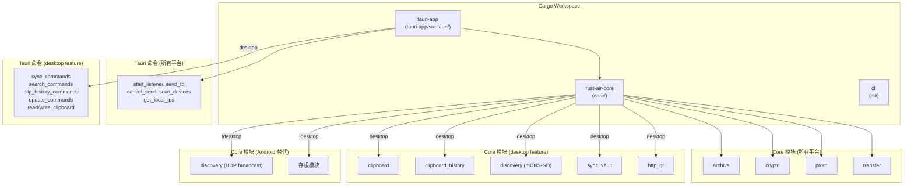

# 设计文档：Android 构建支持

## 概述

本设计文档描述如何为 rust-air（Tauri 2 LAN 文件传输应用）添加 Android 构建支持。核心策略是通过 Cargo feature 和 `#[cfg()]` 条件编译将桌面专用依赖和代码隔离，同时为 Android 平台提供功能等价的替代实现（如 UDP 广播替代 mDNS-SD）。

本方案不要求在本机编译 Android 版本，而是确保所有代码和配置就绪，使项目可以在任何配置了 Android SDK/NDK 的机器上成功构建。

### 设计决策

1. **使用 Cargo feature `desktop` 而非 `#[cfg(target_os = "android")]`**：feature 方式更灵活，桌面构建默认启用 `desktop`，Android 构建不启用。这比硬编码 target_os 更易于测试和维护。
2. **存根模块策略**：对于桌面专用模块，在 `desktop` feature 未启用时提供空的存根类型和函数，确保下游 crate 编译通过而无需大量 `#[cfg]` 散落在调用方。
3. **UDP 广播替代 mDNS-SD**：Android 上 mDNS-SD crate 不可用，采用简单的 UDP 广播/监听方案实现设备发现，复用现有的 `DeviceInfo` / `DeviceStatus` 类型。
4. **前端平台检测**：通过 `window.__TAURI_INTERNALS__` 或 Tauri API 检测平台，在 Android 上隐藏不可用的功能入口（搜索、同步、剪贴板历史、自动更新）。

## 架构



### 构建流程


## 组件和接口

### 1. Core 库条件编译改造

#### Cargo.toml feature 定义

```toml
[features]
default = []
desktop = ["arboard", "notify", "walkdir", "mdns-sd", "if-addrs", "axum", "qrcode", "indicatif", "rayon"]

[dependencies]
# 始终可用
tokio      = { workspace = true }
tokio-util = { workspace = true }
anyhow     = { workspace = true }
serde      = { workspace = true }
chacha20poly1305 = "0.10"
rand       = "0.8"
base64     = "0.22"
sha2       = "0.10"
tar        = "0.4"
zstd       = "0.13"
os_pipe    = "1"
serde_json = "1"
chrono     = { version = "0.4", features = ["serde"] }
dirs       = "5"
unicode-normalization = "0.1"
hex        = "0.4"

# 桌面专用 (可选)
arboard   = { version = "3", optional = true }
notify    = { version = "6", optional = true }
walkdir   = { version = "2", optional = true }
mdns-sd   = { version = "0.19", optional = true }
if-addrs  = { version = "0.13", optional = true }
axum      = { version = "0.7", optional = true }
qrcode    = { version = "0.14", optional = true }
indicatif = { version = "0.17", optional = true }
rayon     = { version = "1", optional = true }
```

#### lib.rs 条件编译结构

```rust
// 所有平台
pub mod archive;
pub mod crypto;
pub mod proto;
pub mod transfer;

// 桌面专用模块
#[cfg(feature = "desktop")]
pub mod clipboard;
#[cfg(feature = "desktop")]
pub mod clipboard_history;
#[cfg(feature = "desktop")]
pub mod sync_vault;
#[cfg(feature = "desktop")]
pub mod http_qr;

// discovery 模块：桌面用 mDNS，Android 用 UDP
#[cfg(feature = "desktop")]
pub mod discovery;
#[cfg(not(feature = "desktop"))]
pub mod discovery_udp;
#[cfg(not(feature = "desktop"))]
pub use discovery_udp as discovery;

// 存根模块 (非桌面平台)
#[cfg(not(feature = "desktop"))]
pub mod stubs;

// 条件导出
#[cfg(feature = "desktop")]
pub use sync_vault::{SyncConfig, SyncEvent, SyncStore, full_sync, start_watcher, fmt_bytes, default_excludes, ExcludeSet};
#[cfg(feature = "desktop")]
pub use clipboard_history::{ClipContent, ClipEntry, HistoryStore};
#[cfg(feature = "desktop")]
pub use transfer::send_clipboard;

pub use proto::{DeviceInfo, DeviceStatus, TransferEvent};
```

### 2. UDP 广播设备发现 (Android)

新增 `core/src/discovery_udp.rs`，提供与 `discovery.rs` 相同的公共接口：

```rust
// discovery_udp.rs — Android 平台的 UDP 广播设备发现
use crate::proto::{DeviceInfo, DeviceStatus};
use anyhow::Result;
use tokio::sync::mpsc;
use std::net::UdpSocket;

const BROADCAST_PORT: u16 = 51820;
const MAGIC: &[u8] = b"RUSTAIR1";

pub struct ServiceHandle { /* UDP socket handle */ }
pub struct BrowseHandle { cancel: tokio::sync::oneshot::Sender<()> }

pub fn register_self(port: u16, device_name: &str) -> Result<ServiceHandle>;
pub fn browse_devices_sync(tx: mpsc::Sender<DeviceInfo>) -> Result<BrowseHandle>;
pub fn local_lan_ip() -> Option<String>;
pub fn safe_device_name() -> String;
pub fn lan_ipv4_addrs() -> Vec<String>;
```

协议：
- 广播包格式：`MAGIC(8B) + port(2B LE) + name_len(1B) + name(UTF-8)`
- 注册时周期性向 `255.255.255.255:BROADCAST_PORT` 发送广播
- 浏览时监听 `0.0.0.0:BROADCAST_PORT`，解析收到的广播包

### 3. 存根模块

`core/src/stubs.rs` 提供非桌面平台所需的类型存根：

```rust
// 为依赖 Core 的 crate 提供编译通过所需的最小类型定义
pub struct SyncConfig;
pub struct SyncEvent;
pub struct SyncStore;
pub struct ExcludeSet;
pub struct ClipContent;
pub struct ClipEntry;
pub struct HistoryStore;

pub fn fmt_bytes(_: u64) -> String { String::new() }
pub fn default_excludes() -> Vec<String> { vec![] }
```

### 4. Tauri App 条件编译改造

#### Cargo.toml

```toml
[features]
default = ["desktop"]
desktop = [
    "rust-air-core/desktop",
    "arboard", "notify", "ignore", "memmap2",
    "num_cpus", "encoding_rs"
]

[dependencies]
# 桌面专用 (可选)
arboard     = { version = "3", optional = true }
notify      = { version = "6", optional = true }
ignore      = { version = "0.4", optional = true }
memmap2     = { version = "0.9", optional = true }
num_cpus    = { version = "1", optional = true }
encoding_rs = { version = "0.8", optional = true }
```

#### lib.rs 条件编译

```rust
mod commands;

#[cfg(feature = "desktop")]
mod sync_commands;
#[cfg(feature = "desktop")]
mod search_commands;
#[cfg(feature = "desktop")]
mod clip_history_commands;
#[cfg(feature = "desktop")]
mod update_commands;

pub fn run() {
    let mut builder = tauri::Builder::default()
        .plugin(tauri_plugin_opener::init())
        .plugin(tauri_plugin_dialog::init())
        .manage(commands::AppState::default());

    #[cfg(feature = "desktop")]
    {
        builder = builder
            .manage(sync_commands::SyncState::new())
            .manage(search_commands::SearchState::new())
            .manage(Arc::new(clip_history_commands::HistoryState::new()));
    }

    builder = builder.setup(move |app| {
        #[cfg(feature = "desktop")]
        {
            // 启动剪贴板监控和自动更新检查
        }
        Ok(())
    });

    // 命令注册
    #[cfg(feature = "desktop")]
    {
        builder = builder.invoke_handler(tauri::generate_handler![
            // 核心命令 + 桌面命令
            commands::start_listener, commands::send_to, commands::cancel_send,
            commands::scan_devices, commands::read_clipboard, commands::write_clipboard,
            commands::get_local_ips, commands::open_path,
            sync_commands::get_sync_config, /* ... 所有桌面命令 ... */
        ]);
    }
    #[cfg(not(feature = "desktop"))]
    {
        builder = builder.invoke_handler(tauri::generate_handler![
            commands::start_listener, commands::send_to, commands::cancel_send,
            commands::scan_devices, commands::get_local_ips,
        ]);
    }

    builder.run(tauri::generate_context!()).expect("error while running tauri application");
}
```

### 5. commands.rs Android 适配

`commands.rs` 中的 `read_clipboard`、`write_clipboard`、`open_path` 需要条件编译：

```rust
#[cfg(feature = "desktop")]
#[tauri::command]
pub fn read_clipboard() -> Result<String, String> { /* ... */ }

#[cfg(feature = "desktop")]
#[tauri::command]
pub fn write_clipboard(text: String) -> Result<(), String> { /* ... */ }
```

`start_listener` 中的 `discovery::register_self` 调用在两个平台上接口一致，无需修改。

### 6. Android 项目配置

#### tauri.conf.json 补充

```json
{
  "bundle": {
    "android": {
      "minSdkVersion": 24
    }
  }
}
```

#### AndroidManifest.xml 权限

由 `tauri android init` 生成后，需手动添加：

```xml
<uses-permission android:name="android.permission.INTERNET" />
<uses-permission android:name="android.permission.ACCESS_NETWORK_STATE" />
<uses-permission android:name="android.permission.ACCESS_WIFI_STATE" />
<uses-permission android:name="android.permission.READ_EXTERNAL_STORAGE" />
<uses-permission android:name="android.permission.WRITE_EXTERNAL_STORAGE" />
<uses-permission android:name="android.permission.CHANGE_WIFI_MULTICAST_STATE" />

<application android:usesCleartextTraffic="true" ...>
```

#### Gradle 签名配置

在 `app/build.gradle.kts` 中添加：

```kotlin
android {
    signingConfigs {
        create("release") {
            val props = java.util.Properties()
            val propsFile = rootProject.file("keystore.properties")
            if (propsFile.exists()) {
                props.load(propsFile.inputStream())
                storeFile = file(props["storeFile"] as String)
                storePassword = props["storePassword"] as String
                keyAlias = props["keyAlias"] as String
                keyPassword = props["keyPassword"] as String
            } else {
                throw GradleException("keystore.properties not found! See docs/android-build.md")
            }
        }
    }
    buildTypes {
        getByName("release") {
            signingConfig = signingConfigs.getByName("release")
        }
    }
}
```

### 7. 前端平台适配

在 `App.vue` 中通过 Tauri API 检测平台：

```typescript
import { platform } from '@tauri-apps/plugin-os';

const isAndroid = ref(false);
onMounted(async () => {
    const p = await platform();
    isAndroid.value = (p === 'android');
});
```

在 Android 上隐藏不可用的 Tab（搜索、同步、设置中的自动更新），并跳过对桌面专用命令的 `invoke` 调用。

## 数据模型

### 现有共享类型（所有平台）

| 类型 | 位置 | 说明 |
|------|------|------|
| `DeviceInfo` | `proto.rs` | 设备信息：name, addr, status |
| `DeviceStatus` | `proto.rs` | 设备状态枚举：Idle, Busy |
| `TransferEvent` | `proto.rs` | 传输进度事件 |

### 新增类型

| 类型 | 位置 | 说明 |
|------|------|------|
| `ServiceHandle` | `discovery_udp.rs` | UDP 广播注册句柄 |
| `BrowseHandle` | `discovery_udp.rs` | UDP 广播浏览句柄 |

### 存根类型（非桌面平台）

| 类型 | 位置 | 说明 |
|------|------|------|
| `SyncConfig` | `stubs.rs` | 空存根，确保编译通过 |
| `ClipEntry` | `stubs.rs` | 空存根 |
| `HistoryStore` | `stubs.rs` | 空存根 |

## 错误处理

| 场景 | 处理方式 |
|------|----------|
| UDP 广播绑定失败 | 返回 `anyhow::Error`，Tauri 命令层转为字符串错误返回前端 |
| Android 上调用桌面专用命令 | 前端平台检测避免调用；若仍调用，Tauri 返回 "command not found" 错误 |
| 签名密钥文件缺失 | Gradle 构建时抛出 `GradleException`，提示查看文档 |
| 网络权限未授予 | Android 系统级错误，TCP/UDP 操作返回 IO 错误，前端显示错误信息 |
| `tauri android init` 失败 | 命令行输出错误信息，通常是环境变量未配置，文档中说明排查步骤 |

## 测试策略

### PBT 适用性评估

本功能主要涉及：
- 项目配置文件修改（Cargo.toml、tauri.conf.json、Gradle 配置）
- 条件编译属性添加（`#[cfg]`）
- Android 项目初始化（`tauri android init`）
- 文档编写

这些都属于 **基础设施配置和构建系统改造**，不涉及可以用属性测试验证的纯函数逻辑。因此 **不适用属性基测试（PBT）**。

### 测试方案

#### 1. 编译验证测试（最关键）

- **桌面编译**：`cargo build -p rust-air-core --features desktop` 确保桌面功能不受影响
- **Android 目标编译**：`cargo build -p rust-air-core --target aarch64-linux-android`（无 desktop feature）确保 Android 编译通过
- **Tauri App 桌面编译**：`cargo build -p tauri-app`（默认启用 desktop）
- **Tauri App Android 编译**：`cargo build -p tauri-app --no-default-features --target aarch64-linux-android`

#### 2. 单元测试

- `discovery_udp.rs`：测试广播包的序列化/反序列化、`safe_device_name()` 函数
- `stubs.rs`：确保存根类型可以正常实例化
- 条件编译：确保 `#[cfg(feature = "desktop")]` 和 `#[cfg(not(feature = "desktop"))]` 不会同时编译同一模块

#### 3. 集成测试

- 在配置了 Android NDK 的机器上运行 `tauri android build --debug`，验证完整构建流程
- 验证生成的 APK 包含正确的权限声明
- 验证签名配置在密钥存在时正常工作，缺失时给出明确错误

#### 4. 手动验证清单

- [ ] `tauri android init` 生成正确的项目结构
- [ ] AndroidManifest.xml 包含所有必需权限
- [ ] APK 可以安装到 Android 设备/模拟器
- [ ] 设备发现（UDP 广播）在 Android 上正常工作
- [ ] 文件传输在 Android 上正常工作
- [ ] 前端在 Android 上正确隐藏桌面专用功能
