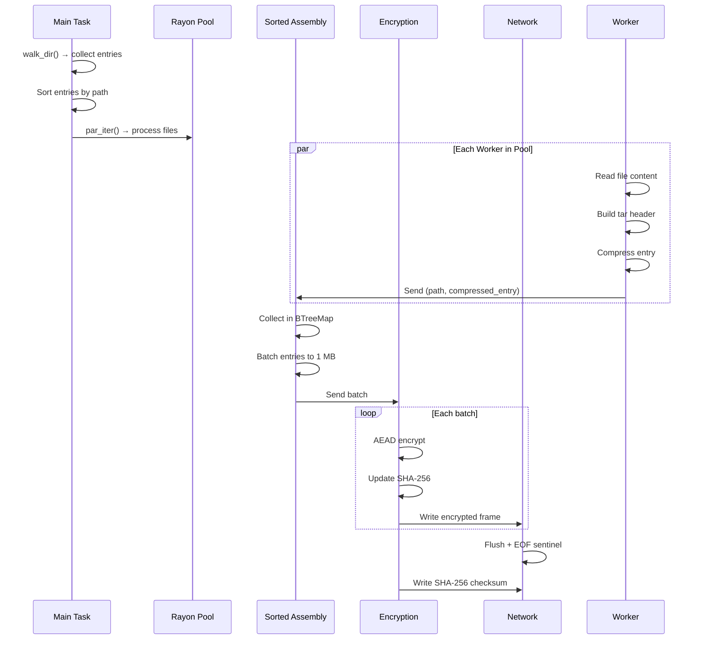

# Design Document: Parallel Small File Transfer

## Overview

This design optimizes directory transfer performance for folders containing many small files. The current architecture processes files sequentially in a single-threaded tar+zstd stream, causing significant overhead when transferring directories with hundreds or thousands of small files.

The optimization introduces a multi-threaded archive generation pipeline that:
1. Reads and compresses files in parallel using rayon
2. Batches small files into larger chunks to reduce encryption overhead
3. Maintains deterministic output regardless of parallel execution
4. Preserves backward compatibility with existing receivers

### Key Design Decisions

| Decision | Rationale |
|----------|-----------|
| Rayon for parallelism | Work-stealing thread pool already used in existing code; proven performance for CPU-bound tasks |
| Per-file compression | Enables parallel compression; maintains tar boundaries for streaming unpack |
| Sorted assembly | Guarantees deterministic output; required for verification and caching |
| Bounded channels | Prevents memory exhaustion; provides backpressure between stages |

## Architecture

### Current Architecture (Single-Threaded)

```
┌─────────────────────────────────────────────────────────────────────┐
│                     Current Archive Pipeline                         │
├─────────────────────────────────────────────────────────────────────┤
│                                                                     │
│  ┌──────────────┐    ┌──────────────┐    ┌──────────────┐          │
│  │ walk_dir()   │───▶│ tar::Builder │───▶│ zstd::Encoder│          │
│  │ (sequential) │    │ (sequential) │    │ (sequential) │          │
│  └──────────────┘    └──────────────┘    └──────────────┘          │
│         │                                        │                  │
│         ▼                                        ▼                  │
│  ┌──────────────┐                       ┌──────────────┐           │
│  │ Read each    │                       │ ChannelWriter│           │
│  │ file one-by- │                       │ → mpsc       │           │
│  │ one          │                       │ channel      │           │
│  └──────────────┘                       └──────────────┘           │
│                                                │                    │
│                                                ▼                    │
│                                         ┌──────────────┐           │
│                                         │ ErrorAware   │           │
│                                         │ Reader       │           │
│                                         │ (AsyncRead)  │           │
│                                         └──────────────┘           │
│                                                                     │
│  Problem: Files processed sequentially even with preloaded small   │
│  files. Compression is single-threaded, creating a bottleneck.    │
└─────────────────────────────────────────────────────────────────────┘
```

### Proposed Architecture (Multi-Threaded)

```
┌────────────────────────────────────────────────────────────────────────────┐
│                    Parallel Archive Pipeline                                │
├────────────────────────────────────────────────────────────────────────────┤
│                                                                            │
│  Stage 1: Parallel Compression (rayon work-stealing pool)                 │
│  ┌─────────────────────────────────────────────────────────────────────┐  │
│  │                                                                     │  │
│  │   ┌──────────┐   ┌──────────┐   ┌──────────┐   ┌──────────┐       │  │
│  │   │ Worker 1 │   │ Worker 2 │   │ Worker 3 │   │ Worker N │       │  │
│  │   │          │   │          │   │          │   │          │       │  │
│  │   │ Read     │   │ Read     │   │ Read     │   │ Read     │       │  │
│  │   │ file     │   │ file     │   │ file     │   │ file     │       │  │
│  │   │ Create   │   │ Create   │   │ Create   │   │ Create   │       │  │
│  │   │ tar hdr  │   │ tar hdr  │   │ tar hdr  │   │ tar hdr  │       │  │
│  │   │ Compress │   │ Compress │   │ Compress │   │ Compress │       │  │
│  │   │ with     │   │ with     │   │ with     │   │ with     │       │  │
│  │   │ zstd     │   │ zstd     │   │ zstd     │   │ zstd     │       │  │
│  │   └────┬─────┘   └────┬─────┘   └────┬─────┘   └────┬─────┘       │  │
│  │        │              │              │              │              │  │
│  │        └──────────────┴──────────────┴──────────────┘              │  │
│  │                              │                                     │  │
│  │                              ▼                                     │  │
│  │                    ┌──────────────────┐                           │  │
│  │                    │ IndexedChunk {   │                           │  │
│  │                    │   sort_key: Path,│                           │  │
│  │                    │   tar_entry: Vec,│                           │  │
│  │                    │   compressed: Vec│                           │  │
│  │                    │ }                │                           │  │
│  │                    └────────┬─────────┘                           │  │
│  └─────────────────────────────┼──────────────────────────────────────┘  │
│                                │                                          │
│                                ▼                                          │
│  Stage 2: Sorted Assembly (sequential, deterministic)                    │
│  ┌─────────────────────────────────────────────────────────────────────┐  │
│  │                                                                     │  │
│  │   ┌──────────────────┐                                              │  │
│  │   │ BTreeMap<Path,   │   ← Sort by path for determinism            │  │
│  │   │   CompressedEntry│                                              │  │
│  │   │ >                │                                              │  │
│  │   └────────┬─────────┘                                              │  │
│  │            │                                                        │  │
│  │            ▼                                                        │  │
│  │   ┌──────────────────┐                                              │  │
│  │   │ Batch Buffer     │   ← Accumulate entries up to CHUNK (1 MB)   │  │
│  │   │ (1 MB target)    │                                              │  │
│  │   └────────┬─────────┘                                              │  │
│  │            │                                                        │  │
│  │            ▼                                                        │  │
│  │   ┌──────────────────┐                                              │  │
│  │   │ Send batch via   │   ← Bounded channel (PIPELINE_DEPTH = 4)    │  │
│  │   │ mpsc::Sender     │     provides backpressure                   │  │
│  │   └──────────────────┘                                              │  │
│  └─────────────────────────────────────────────────────────────────────┘  │
│                                                                            │
│  Stage 3: Encryption + Network (existing pipeline)                        │
│  ┌─────────────────────────────────────────────────────────────────────┐  │
│  │                                                                     │  │
│  │   ┌──────────────────┐   ┌──────────────────┐   ┌──────────────┐  │  │
│  │   │ Encryptor        │──▶│ Hash (SHA-256)   │──▶│ TCP Socket   │  │  │
│  │   │ (ChaCha20-Poly)  │   │ (on-the-fly)     │   │ (async write)│  │  │
│  │   └──────────────────┘   └──────────────────┘   └──────────────┘  │  │
│  │                                                                     │  │
│  └─────────────────────────────────────────────────────────────────────┘  │
│                                                                            │
└────────────────────────────────────────────────────────────────────────────┘
```

### Pipeline Data Flow



## Components and Interfaces

### 1. ParallelArchiveGenerator

The main component that orchestrates parallel archive creation.

```rust
/// Configuration for parallel archive generation
pub struct ParallelArchiveConfig {
    /// Maximum compression threads (default: min(num_cpus, 8))
    pub compression_threads: usize,
    
    /// Batch size for small files (default: CHUNK = 1 MB)
    pub batch_size: usize,
    
    /// Small file threshold (default: 64 KB for level 1, 1 MB for level 3)
    pub small_file_threshold: u64,
    
    /// Compression levels by file size tier
    pub compression_levels: CompressionLevels,
}

pub struct CompressionLevels {
    /// Files < 64 KB
    pub tiny: i32,    // default: 1
    /// Files 64 KB - 1 MB  
    pub small: i32,   // default: 3
    /// Files >= 1 MB
    pub large: i32,   // default: 3
}

/// Entry produced by parallel compression
struct CompressedEntry {
    /// Relative path within archive (for sorting)
    path: PathBuf,
    
    /// Complete tar entry: header + data (compressed)
    tar_data: Vec<u8>,
    
    /// Original uncompressed size (for progress)
    original_size: u64,
    
    /// Compressed size
    compressed_size: u64,
}

/// Main entry point for parallel archive generation
pub fn stream_archive_parallel(
    path: &Path,
    entries: Vec<(DirEntry, Metadata)>,
    config: ParallelArchiveConfig,
) -> Result<impl AsyncRead + Send + Unpin + 'static> {
    // Implementation detailed below
}
```

### 2. Stage 1: Parallel Compression

```rust
/// Process files in parallel, producing compressed tar entries
fn compress_entries_parallel(
    path: &Path,
    entries: Vec<(DirEntry, Metadata)>,
    config: &ParallelArchiveConfig,
    tx: mpsc::Sender<CompressedEntry>,
    error_slot: Arc<Mutex<Option<String>>>,
) -> Result<()> {
    // Partition into small (< 1 MB) and large files
    let (small, large): (Vec<_>, Vec<_>) = entries
        .into_iter()
        .partition(|(_, meta)| meta.len() < SMALL_FILE_THRESHOLD);
    
    // Process small files in parallel
    let results: Vec<Result<CompressedEntry, String>> = small
        .into_par_iter()
        .map(|(entry, meta)| {
            compress_single_entry(&entry, &meta, path, config)
                .map_err(|e| format!("failed to process {}: {}", entry.path().display(), e))
        })
        .collect();
    
    // Check for errors and propagate
    for result in results {
        match result {
            Ok(entry) => tx.blocking_send(entry)?,
            Err(msg) => {
                *error_slot.lock().unwrap() = Some(msg);
                bail!("parallel compression failed");
            }
        }
    }
    
    // Process large files sequentially (streaming, no full buffer)
    for (entry, meta) in large {
        let compressed = compress_large_entry(&entry, &meta, path, config)?;
        tx.blocking_send(compressed)?;
    }
    
    Ok(())
}

/// Compress a single file entry with tar header
fn compress_single_entry(
    entry: &DirEntry,
    meta: &Metadata,
    base_path: &Path,
    config: &ParallelArchiveConfig,
) -> Result<CompressedEntry> {
    let path = entry.path();
    let rel_path = path.strip_prefix(base_path)?;
    
    // Read file content
    let data = std::fs::read(path)?;
    
    // Build tar header
    let mut header = tar::Header::new_gnu();
    header.set_metadata(meta);
    header.set_size(data.len() as u64);
    header.set_cksum();
    
    // Select compression level based on file size
    let level = select_compression_level(data.len(), &config.compression_levels);
    
    // Compress: tar header + data
    let mut tar_buf = Vec::with_capacity(512 + data.len());
    header.append_to(&mut tar_buf)?;
    tar_buf.extend_from_slice(&data);
    
    let compressed = zstd::encode_all(&tar_buf[..], level)?;
    
    Ok(CompressedEntry {
        path: rel_path.to_path_buf(),
        tar_data: compressed,
        original_size: data.len() as u64,
        compressed_size: compressed.len() as u64,
    })
}

fn select_compression_level(size: usize, levels: &CompressionLevels) -> i32 {
    const TINY_THRESHOLD: usize = 64 * 1024;  // 64 KB
    const SMALL_THRESHOLD: usize = 1024 * 1024;  // 1 MB
    
    if size < TINY_THRESHOLD {
        levels.tiny
    } else if size < SMALL_THRESHOLD {
        levels.small
    } else {
        levels.large
    }
}
```

### 3. Stage 2: Sorted Assembly with Batching

```rust
/// Assemble compressed entries in sorted order, batch for encryption
struct BatchAssembler {
    /// Sorted map of path → compressed entry
    entries: BTreeMap<PathBuf, CompressedEntry>,
    
    /// Target batch size (CHUNK = 1 MB)
    batch_size: usize,
    
    /// Output channel
    tx: mpsc::Sender<Vec<u8>>,
}

impl BatchAssembler {
    fn new(batch_size: usize, tx: mpsc::Sender<Vec<u8>>) -> Self {
        Self {
            entries: BTreeMap::new(),
            batch_size,
            tx,
        }
    }
    
    /// Add a compressed entry from parallel workers
    fn add_entry(&mut self, entry: CompressedEntry) {
        self.entries.insert(entry.path.clone(), entry);
    }
    
    /// Flush all entries as batched chunks
    fn flush(mut self) -> Result<()> {
        let mut batch = Vec::with_capacity(self.batch_size);
        
        for (_, entry) in self.entries.into_iter() {
            // Check if adding this entry would exceed batch size
            if batch.len() + entry.tar_data.len() > self.batch_size && !batch.is_empty() {
                // Send current batch, start new one
                let chunk = std::mem::replace(&mut batch, Vec::with_capacity(self.batch_size));
                self.tx.blocking_send(chunk)?;
            }
            
            batch.extend_from_slice(&entry.tar_data);
        }
        
        // Send final batch
        if !batch.is_empty() {
            self.tx.blocking_send(batch)?;
        }
        
        Ok(())
    }
}
```

### 4. Integration with Existing Pipeline

```rust
/// New function in archive.rs
pub fn stream_archive_parallel(
    path: &Path,
    entries: Vec<(DirEntry, Metadata)>,
) -> Result<impl AsyncRead + Send + Unpin + 'static> {
    let config = ParallelArchiveConfig::default();
    stream_archive_parallel_with_config(path, entries, config)
}

pub fn stream_archive_parallel_with_config(
    path: &Path,
    entries: Vec<(DirEntry, Metadata)>,
    config: ParallelArchiveConfig,
) -> Result<impl AsyncRead + Send + Unpin + 'static> {
    let (tx, rx) = mpsc::channel::<Vec<u8>>(PIPELINE_DEPTH);
    let error_slot = Arc::new(Mutex::new(None));
    let error_slot_reader = error_slot.clone();
    
    let path = path.to_path_buf();
    
    // Spawn compression thread
    std::thread::spawn(move || {
        let (compress_tx, compress_rx) = std::sync::mpsc::channel::<CompressedEntry>();
        
        // Spawn assembler in another thread
        let assembler_tx = tx.clone();
        let batch_size = config.batch_size;
        std::thread::spawn(move || {
            let mut assembler = BatchAssembler::new(batch_size, assembler_tx);
            while let Ok(entry) = compress_rx.recv() {
                assembler.add_entry(entry);
            }
            assembler.flush()
        });
        
        // Run parallel compression
        if let Err(e) = compress_entries_parallel(&path, entries, &config, compress_tx, error_slot) {
            *error_slot.lock().unwrap() = Some(e.to_string());
        }
    });
    
    Ok(ErrorAwareReader {
        rx,
        error_slot: error_slot_reader,
        remainder: Vec::new(),
        offset: 0,
    })
}
```

## Data Models

### IndexedChunk (Internal)

```rust
/// Internal representation during parallel processing
struct IndexedChunk {
    /// Sort key for deterministic ordering
    sort_key: PathBuf,
    
    /// Complete tar entry (header + data, compressed)
    data: Vec<u8>,
    
    /// Size metrics for progress reporting
    original_size: u64,
    compressed_size: u64,
}
```

### BatchBuffer (Internal)

```rust
/// Accumulates entries into CHUNK-sized batches
struct BatchBuffer {
    /// Maximum batch size
    capacity: usize,
    
    /// Current accumulated data
    data: Vec<u8>,
    
    /// Number of entries in current batch
    entry_count: usize,
}
```

### CompressionLevels (Configuration)

```rust
/// Compression level selection by file size tier
pub struct CompressionLevels {
    /// Files < 64 KB: fastest compression
    pub tiny: i32,    // default: 1
    
    /// Files 64 KB - 1 MB: balanced
    pub small: i32,   // default: 3
    
    /// Files >= 1 MB: same as current
    pub large: i32,   // default: 3
}
```

## Correctness Properties

*A property is a characteristic or behavior that should hold true across all valid executions of a system—essentially, a formal statement about what the system should do. Properties serve as the bridge between human-readable specifications and machine-verifiable correctness guarantees.*

### Property 1: Deterministic Archive Order

*For any* set of files processed by the parallel archive generator, the resulting tar entry order SHALL be sorted lexicographically by path, regardless of which thread processed each file or the order of completion.

**Validates: Requirements 1.2, 9.1, 9.2**

### Property 2: Archive Round-Trip Integrity

*For any* directory archived with the parallel generator and unpacked by the existing `unpack_archive_sync` function, all files SHALL be extracted with identical content, and the set of extracted files SHALL match the original directory.

**Validates: Requirements 2.4, 6.2, 6.3**

### Property 3: Checksum Verification

*For any* archive generated by the parallel archive generator, the SHA-256 checksum computed during streaming SHALL match the checksum verified by the receiver after decryption.

**Validates: Requirements 6.4**

### Property 4: Bounded Memory Usage

*For any* archive generation with N compression threads, CHUNK_SIZE batch size, and PIPELINE_DEPTH channel depth, the total in-flight memory SHALL NOT exceed N × CHUNK_SIZE × PIPELINE_DEPTH + (number of small files × average small file size).

**Validates: Requirements 5.1**

### Property 5: Error Propagation

*For any* file that cannot be read during parallel archive generation, the error message SHALL contain the file path, and the archive generation SHALL terminate without producing a partial archive.

**Validates: Requirements 1.5, 8.1**

### Property 6: Batch Size Bounds

*For any* batch of small files sent to the encryption pipeline, the batch size SHALL be at least 256 KB and at most 4 MB, except for the final batch which may be smaller.

**Validates: Requirements 2.1, 2.2**

### Property 7: Pipeline Error Shutdown

*For any* error occurring in any pipeline stage (compression, assembly, encryption, or network), all upstream stages SHALL terminate within a bounded time, and the error SHALL be propagated to the caller.

**Validates: Requirements 4.6**

### Property 8: Large File Streaming

*For any* file larger than SMALL_FILE_THRESHOLD (1 MB), the archive generator SHALL NOT buffer the entire file content in memory; instead, it SHALL stream the file in chunks.

**Validates: Requirements 5.3, 5.4**

### Property 9: Compression Level Selection

*For any* file with size S:
- If S < 64 KB: compression level SHALL be `tiny` (default 1)
- If 64 KB ≤ S < 1 MB: compression level SHALL be `small` (default 3)  
- If S ≥ 1 MB: compression level SHALL be `large` (default 3)

**Validates: Requirements 3.1, 3.2, 3.3**

## Error Handling

### Error Categories

The system distinguishes between three error categories:

1. **I/O Errors**: File read failures, permission denied, disk full
2. **Compression Errors**: Zstd compression failures, memory allocation failures
3. **Network Errors**: Connection dropped, timeout, encryption failures

### Error Propagation Flow

```
┌─────────────────────────────────────────────────────────────────────┐
│                    Error Propagation Flow                            │
├─────────────────────────────────────────────────────────────────────┤
│                                                                     │
│  ┌──────────────┐                                                   │
│  │ File Read    │──▶ Error with file path + OS error               │
│  │ Error        │                                                   │
│  └──────────────┘                                                   │
│                                                                     │
│  ┌──────────────┐                                                   │
│  │ Compression  │──▶ Error with "compression failed" + details     │
│  │ Error        │                                                   │
│  └──────────────┘                                                   │
│                                                                     │
│  ┌──────────────┐                                                   │
│  │ Channel Send │──▶ Error with "pipeline stage failed"            │
│  │ Error        │                                                   │
│  └──────────────┘                                                   │
│                                                                     │
│  ┌──────────────┐                                                   │
│  │ Network      │──▶ Preserve .part + manifest for resume          │
│  │ Error        │                                                   │
│  └──────────────┘                                                   │
│                                                                     │
│  All errors → error_slot (Arc<Mutex<Option<String>>>)              │
│             → ErrorAwareReader checks on EOF                        │
│             → Returns io::Error to async runtime                    │
│                                                                     │
└─────────────────────────────────────────────────────────────────────┘
```

### Panic Handling

Rayon catches panics in parallel iterators. The error is captured via the `error_slot`:

```rust
// In compress_entries_parallel
let results: Vec<Result<CompressedEntry, String>> = small
    .into_par_iter()
    .map(|(entry, meta)| {
        // Panic in here is caught by rayon
        compress_single_entry(&entry, &meta, path, config)
            .map_err(|e| format!("failed to process {}: {}", entry.path().display(), e))
    })
    .collect();

// Check for panics (rayon returns Err on panic)
for result in results {
    if let Err(msg) = result {
        *error_slot.lock().unwrap() = Some(msg);
        bail!("parallel compression failed");
    }
}
```

### Resume Compatibility

Network errors preserve the `.part` file and manifest for resume:

- The receiver's 3-stage pipeline writes to `.part` file
- On error, the file is not deleted
- The manifest persists with transfer metadata
- Next transfer resumes from last chunk boundary

## Testing Strategy

### Property-Based Tests

Property-based tests use `proptest` or `quickcheck` to verify universal properties across many randomly generated inputs.

#### Test Configuration

```rust
use proptest::prelude::*;

// Minimum 100 iterations per property test
proptest! {
    #![proptest_config(ProptestConfig::with_cases(100))]
    
    // Property tests here
}
```

#### Property Test Implementations

**Test 1: Deterministic Archive Order**
```rust
// Feature: parallel-small-file-transfer, Property 1: Deterministic Archive Order
proptest! {
    #[test]
    fn test_deterministic_archive_order(files in prop::collection::vec(
        (any::<String>(), any::<Vec<u8>>()),
        1..100
    )) {
        // Create temp directory with files
        let dir = tempfile::tempdir().unwrap();
        for (name, content) in &files {
            let path = dir.path().join(name);
            std::fs::create_dir_all(path.parent().unwrap()).ok();
            std::fs::write(&path, content).unwrap();
        }
        
        // Archive twice
        let archive1 = create_archive(dir.path()).unwrap();
        let archive2 = create_archive(dir.path()).unwrap();
        
        // Verify identical output
        prop_assert_eq!(archive1, archive2);
        
        // Verify sorted order
        let entries = list_tar_entries(&archive1);
        let mut sorted = entries.clone();
        sorted.sort();
        prop_assert_eq!(entries, sorted);
    }
}
```

**Test 2: Archive Round-Trip Integrity**
```rust
// Feature: parallel-small-file-transfer, Property 2: Archive Round-Trip Integrity
proptest! {
    #[test]
    fn test_archive_round_trip(files in prop::collection::hash_map(
        "[a-z]{1,10}",
        any::<Vec<u8>>(),
        1..50
    )) {
        let dir = tempfile::tempdir().unwrap();
        for (name, content) in &files {
            std::fs::write(dir.path().join(name), content).unwrap();
        }
        
        // Archive with parallel generator
        let archive = create_archive_parallel(dir.path()).unwrap();
        
        // Unpack with existing function
        let out_dir = tempfile::tempdir().unwrap();
        unpack_archive_sync(&archive[..], out_dir.path()).unwrap();
        
        // Verify all files present with correct content
        for (name, expected) in &files {
            let actual = std::fs::read(out_dir.path().join(name)).unwrap();
            prop_assert_eq!(&actual, expected);
        }
    }
}
```

**Test 3: Bounded Memory Usage**
```rust
// Feature: parallel-small-file-transfer, Property 4: Bounded Memory Usage
#[test]
fn test_bounded_memory() {
    // Track peak memory during archive generation
    let config = ParallelArchiveConfig {
        compression_threads: 4,
        batch_size: CHUNK,
        ..Default::default()
    };
    
    // Create directory with many small files
    let dir = tempfile::tempdir().unwrap();
    for i in 0..1000 {
        std::fs::write(dir.path().join(format!("file_{i}")), vec![0u8; 10 * 1024]).unwrap();
    }
    
    // Monitor memory during archive
    let peak_memory = monitor_memory_during(|| {
        create_archive_parallel_with_config(dir.path(), config.clone())
    });
    
    // Verify bounded: N × CHUNK × DEPTH = 4 × 1MB × 4 = 16 MB
    let bound = config.compression_threads * CHUNK * PIPELINE_DEPTH;
    assert!(peak_memory < bound * 2, "Memory {} exceeded bound {}", peak_memory, bound * 2);
}
```

**Test 4: Error Propagation**
```rust
// Feature: parallel-small-file-transfer, Property 5: Error Propagation
proptest! {
    #[test]
    fn test_error_contains_path(filenames in prop::collection::vec("[a-z]{1,10}", 5..20)) {
        let dir = tempfile::tempdir().unwrap();
        for name in &filenames {
            std::fs::write(dir.path().join(name), vec![0u8; 1024]).unwrap();
        }
        
        // Make one file unreadable
        let unreadable = dir.path().join(&filenames[0]);
        #[cfg(unix)]
        std::fs::set_permissions(&unreadable, std::os::unix::fs::Permissions::from_mode(0o000)).unwrap();
        
        // Attempt archive - should fail with path in error
        let result = create_archive_parallel(dir.path());
        prop_assert!(result.is_err());
        
        let err = result.unwrap_err().to_string();
        prop_assert!(err.contains(&filenames[0]));
        
        // Cleanup
        #[cfg(unix)]
        std::fs::set_permissions(&unreadable, std::os::unix::fs::Permissions::from_mode(0o644)).ok();
    }
}
```

### Unit Tests

Unit tests verify specific examples, edge cases, and configuration validation.

```rust
#[test]
fn test_compression_level_tiny() {
    let levels = CompressionLevels::default();
    assert_eq!(select_compression_level(63 * 1024, &levels), levels.tiny);
}

#[test]
fn test_compression_level_small() {
    let levels = CompressionLevels::default();
    assert_eq!(select_compression_level(64 * 1024, &levels), levels.small);
    assert_eq!(select_compression_level(1023 * 1024, &levels), levels.small);
}

#[test]
fn test_compression_level_large() {
    let levels = CompressionLevels::default();
    assert_eq!(select_compression_level(1024 * 1024, &levels), levels.large);
}

#[test]
fn test_batch_size_boundaries() {
    let mut assembler = BatchAssembler::new(CHUNK, /* mock sender */);
    // Add entries totaling > CHUNK
    // Verify batch is sent when full
    // Verify final batch is sent on flush
}
```

### Integration Tests

Integration tests verify end-to-end behavior with actual network and file I/O.

```rust
#[tokio::test]
async fn test_parallel_archive_throughput() {
    // Create directory with 1000 × 10KB files
    let dir = tempfile::tempdir().unwrap();
    for i in 0..1000 {
        std::fs::write(dir.path().join(format!("file_{i}")), vec![0u8; 10 * 1024]).unwrap();
    }
    
    let start = Instant::now();
    let archive = create_archive_parallel(dir.path()).unwrap();
    let duration = start.elapsed();
    
    let throughput_mb = (archive.len() as f64 / duration.as_secs_f64()) / (1024.0 * 1024.0);
    println!("Throughput: {:.2} MB/s", throughput_mb);
    
    // Target: ≥100 MB/s on gigabit LAN (may vary on test hardware)
}

#[tokio::test]
async fn test_backward_compatibility() {
    // Create archive with optimized sender
    let archive_parallel = create_archive_parallel(test_dir.path()).unwrap();
    
    // Unpack with existing unpack_archive_sync
    let out_dir = tempfile::tempdir().unwrap();
    unpack_archive_sync(&archive_parallel[..], out_dir.path()).unwrap();
    
    // Verify contents match original
    verify_directory_contents(test_dir.path(), out_dir.path());
}
```

### Benchmarks

Benchmarks measure throughput under various conditions.

```rust
use criterion::{criterion_group, criterion_main, Criterion};

fn bench_parallel_archive(c: &mut Criterion) {
    let dir = tempfile::tempdir().unwrap();
    for i in 0..1000 {
        std::fs::write(dir.path().join(format!("file_{i}")), vec![0u8; 10 * 1024]).unwrap();
    }
    
    c.bench_function("parallel_archive_1000_files", |b| {
        b.iter(|| create_archive_parallel(dir.path()).unwrap())
    });
}

fn bench_sequential_archive(c: &mut Criterion) {
    let dir = tempfile::tempdir().unwrap();
    for i in 0..1000 {
        std::fs::write(dir.path().join(format!("file_{i}")), vec![0u8; 10 * 1024]).unwrap();
    }
    
    c.bench_function("sequential_archive_1000_files", |b| {
        b.iter(|| create_archive_sequential(dir.path()).unwrap())
    });
}

criterion_group!(benches, bench_parallel_archive, bench_sequential_archive);
criterion_main!(benches);
```

## Implementation Notes

### Transition Strategy

The implementation will be incremental:

1. **Phase 1**: Add `stream_archive_parallel` as new function alongside existing `stream_archive_with_entries`
2. **Phase 2**: Add configuration flag to switch between implementations
3. **Phase 3**: Enable parallel by default after validation
4. **Phase 4**: Deprecate/remove sequential implementation if parallel proves reliable

### Backward Compatibility Guarantee

- Wire protocol remains unchanged (MAGIC, header format, chunk framing)
- Tar+zstd format remains standard (compatible with `tar` command-line tool)
- Existing receivers work without modification
- SHA-256 checksum verification unchanged

### Performance Targets

| Scenario | Target Throughput |
|----------|-------------------|
| 1000 × 10KB files | ≥100 MB/s |
| 100 × 100KB files | ≥100 MB/s |
| 10 × 1MB files | ≥100 MB/s |
| Mixed small/large files | ≥80 MB/s |

### Resource Limits

| Resource | Limit |
|----------|-------|
| Compression threads | min(num_cpus, 8) |
| Batch size | 256 KB - 4 MB (configurable) |
| Channel depth | PIPELINE_DEPTH (4) |
| Peak memory | N × CHUNK × DEPTH + small file buffer |
