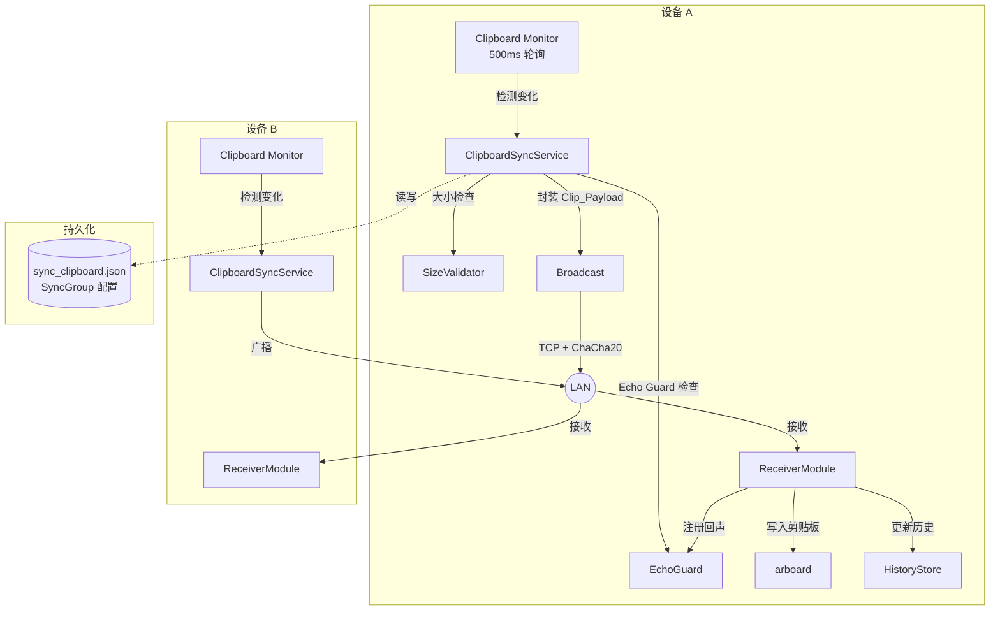

# 设计文档：共享剪贴板

## 概述

共享剪贴板功能在局域网内多台 rust-air 设备之间实现实时剪贴板内容同步。核心思路是在现有架构上做最小侵入式扩展：

- **复用 mDNS-SD 发现**：不新增发现协议，直接利用 `discovery` 模块获取在线设备列表
- **复用加密传输通道**：使用现有 `Kind::Clipboard` + ChaCha20-Poly1305 加密流，每次传输生成一次性密钥
- **新增 `clipboard_sync` 模块**：在 `core/src/` 中新增独立模块，负责同步组管理、回声抑制、广播调度
- **前端集成**：通过 Tauri 事件系统推送同步状态，在现有剪贴板历史中标注来源设备

设计目标是让用户在设备 A 上复制内容后，设备 B/C 在 2 秒内自动收到并写入本地剪贴板，同时通过 Echo Guard 防止内容在设备间无限循环。

## 架构

### 整体架构图



### 数据流

1. **发送流程**：Clipboard Monitor 检测变化 → Echo Guard 过滤 → Size Validator 检查 → 封装 Clip_Payload → 对 Sync_Group 中每个在线设备建立 TCP 连接 → 使用现有 `transfer::send_clipboard` 协议发送
2. **接收流程**：TCP Listener 接收 `Kind::Clipboard` 数据 → 解密验证 → 写入本地剪贴板 → 注册到 Echo Guard → 通知前端更新历史
3. **回声抑制**：Echo Guard 维护一个 `(content_hash, timestamp)` 的滑动窗口，3 秒内相同内容的本地变化不会触发广播

## 组件与接口

### 1. ClipboardSyncService（核心调度器）

位于 `core/src/clipboard_sync.rs`，是共享剪贴板的核心模块。

```rust
/// 同步组中的设备信息
#[derive(Debug, Clone, Serialize, Deserialize, PartialEq, Eq)]
pub struct SyncPeer {
    /// mDNS 全名，如 "DESKTOP-ABC-a1b2._rustair._tcp.local."
    pub device_name: String,
    /// "ip:port" 地址
    pub addr: String,
    /// 最后一次发现的时间戳（Unix 秒）
    pub last_seen: u64,
    /// 是否在线（last_seen 距今 < 30s）
    pub online: bool,
}

/// 同步组配置（持久化到磁盘）
#[derive(Debug, Clone, Serialize, Deserialize, PartialEq)]
pub struct SyncGroupConfig {
    /// 是否启用剪贴板共享
    pub enabled: bool,
    /// 同步组中的设备列表
    pub peers: Vec<SyncPeer>,
}

/// 通过网络传输的剪贴板数据包
#[derive(Debug, Clone, Serialize, Deserialize)]
pub struct ClipPayload {
    /// 内容类型："text" 或 "image"
    pub content_type: String,
    /// 文本内容（content_type == "text" 时有值）
    pub text: Option<String>,
    /// PNG 编码的图片数据（content_type == "image" 时有值）
    pub image_png: Option<Vec<u8>>,
    /// 发送方设备名称
    pub source_device: String,
    /// 时间戳（Unix 毫秒）
    pub timestamp: u64,
}

/// 同步服务主结构
pub struct ClipboardSyncService {
    config: Arc<Mutex<SyncGroupConfig>>,
    echo_guard: Arc<Mutex<EchoGuard>>,
    enabled: Arc<AtomicBool>,
}

impl ClipboardSyncService {
    /// 从磁盘加载配置并创建服务
    pub fn new() -> Self;
    
    /// 获取当前配置
    pub fn config(&self) -> SyncGroupConfig;
    
    /// 保存配置到磁盘
    pub fn save_config(&self, config: SyncGroupConfig);
    
    /// 添加设备到同步组
    pub fn add_peer(&self, peer: SyncPeer);
    
    /// 从同步组移除设备
    pub fn remove_peer(&self, device_name: &str);
    
    /// 更新设备在线状态（由 mDNS 发现回调触发）
    pub fn update_peer_status(&self, device_name: &str, addr: &str);
    
    /// 启用/禁用同步
    pub fn set_enabled(&self, enabled: bool);
    
    /// 检查内容是否应该广播（Echo Guard + 大小限制）
    pub fn should_broadcast(&self, content: &ClipContent) -> bool;
    
    /// 向所有在线设备广播剪贴板内容
    pub async fn broadcast(&self, content: ClipContent) -> Vec<BroadcastResult>;
    
    /// 处理接收到的远程剪贴板内容
    pub fn handle_received(&self, payload: ClipPayload) -> Result<ClipContent>;
    
    /// 获取在线设备列表（用于广播）
    pub fn online_peers(&self) -> Vec<SyncPeer>;
}
```

### 2. EchoGuard（回声抑制器）

```rust
/// 回声抑制器，防止收到的远程内容被重新广播
pub struct EchoGuard {
    /// (content_hash, expiry_time) 的列表
    suppressed: Vec<(u64, Instant)>,
    /// 抑制窗口时长
    window: Duration, // 默认 3 秒
}

impl EchoGuard {
    pub fn new(window: Duration) -> Self;
    
    /// 注册一个需要抑制的内容哈希
    pub fn register(&mut self, content_hash: u64);
    
    /// 检查内容是否应该被抑制
    pub fn is_suppressed(&mut self, content_hash: u64) -> bool;
    
    /// 清理过期条目
    fn cleanup(&mut self);
}
```

回声抑制使用 FNV-1a 哈希（复用现有 `fnv1a` 函数）对内容计算指纹。当 Receiver 写入本地剪贴板后，将内容哈希注册到 EchoGuard。Monitor 检测到变化时先查询 EchoGuard，如果命中则跳过广播。

### 3. SizeValidator（大小校验器）

```rust
/// 内容大小限制常量
pub const TEXT_MAX_BYTES: usize = 10 * 1024 * 1024;  // 10 MB
pub const IMAGE_MAX_BYTES: usize = 50 * 1024 * 1024; // 50 MB

/// 检查内容是否在大小限制内
pub fn validate_size(content: &ClipContent) -> Result<(), SizeError>;

pub enum SizeError {
    TextTooLarge { size: usize, limit: usize },
    ImageTooLarge { size: usize, limit: usize },
}
```

### 4. Tauri 命令层（`tauri-app/src-tauri/src/clip_sync_commands.rs`）

```rust
pub struct ClipSyncState {
    pub service: Arc<ClipboardSyncService>,
}

#[tauri::command]
pub fn get_sync_group() -> SyncGroupConfig;

#[tauri::command]
pub fn save_sync_group(config: SyncGroupConfig);

#[tauri::command]
pub fn add_sync_peer(device_name: String, addr: String);

#[tauri::command]
pub fn remove_sync_peer(device_name: String);

#[tauri::command]
pub fn set_clip_sync_enabled(enabled: bool);

#[tauri::command]
pub fn get_clip_sync_enabled() -> bool;
```

### 5. 与现有模块的集成点

| 现有模块 | 集成方式 |
|---------|---------|
| `discovery.rs` | 复用 `browse_devices_sync` 获取设备列表，在 `device-found` 事件中更新 SyncPeer 的 `last_seen` |
| `transfer.rs` | 复用 `send_clipboard` 发送文本，新增 `send_clipboard_image` 发送 PNG 图片 |
| `crypto.rs` | 无修改，通过 transfer 模块间接使用 ChaCha20-Poly1305 |
| `proto.rs` | 复用 `Kind::Clipboard`，无需新增 Kind 变体 |
| `clipboard_history.rs` | 扩展 `ClipEntry` 增加 `source_device: Option<String>` 字段标注来源 |
| `clip_history_commands.rs` | 修改 `start_clip_monitor` 在检测到变化时触发同步广播 |

## 数据模型

### Clip_Payload 网络协议

共享剪贴板复用现有的 v4 传输协议（`proto.rs`），不引入新的线协议：

```
发送方 → 接收方:
  [4B MAGIC "RAR4"]
  [32B one-time-key]
  [1B kind = 0x03 (Clipboard)]
  [2B name_len]
  [name bytes]          ← "clip:text" 或 "clip:image"
  [8B total_size]       ← payload 字节数

接收方 → 发送方:
  [8B already_have = 0] ← 剪贴板不支持断点续传

发送方 → 接收方:
  [AEAD encrypted chunks...]
  [EOF sentinel: 4B zero]
  [32B SHA-256]
```

**name 字段编码**：使用 `clip:text` 或 `clip:image` 前缀区分内容类型，接收方通过 name 前缀判断如何处理。同时在 name 中附加发送方设备名，格式为 `clip:text:DEVICE_NAME` 或 `clip:image:DEVICE_NAME`。

**Payload 内容**：
- 文本：UTF-8 编码的原始文本字节
- 图片：PNG 编码的图片数据（发送前将 RGBA 编码为 PNG，接收后解码回 RGBA）

### SyncGroupConfig 持久化

存储路径：`{data_local_dir}/rust-air/sync_clipboard.json`

```json
{
  "enabled": true,
  "peers": [
    {
      "device_name": "DESKTOP-ABC-a1b2._rustair._tcp.local.",
      "addr": "192.168.1.100:12345",
      "last_seen": 1700000000,
      "online": true
    }
  ]
}
```

### ClipEntry 扩展

在 `ClipEntry` 中新增可选字段：

```rust
#[derive(Debug, Clone, Serialize, Deserialize)]
pub struct ClipEntry {
    // ... 现有字段 ...
    
    /// 来源设备名称（None 表示本地复制）
    #[serde(skip_serializing_if = "Option::is_none")]
    pub source_device: Option<String>,
}
```

### EchoGuard 内部状态

```rust
struct EchoGuard {
    /// (content_fnv1a_hash, expiry_instant)
    suppressed: Vec<(u64, Instant)>,
    window: Duration, // 3s
}
```

使用 FNV-1a 哈希（已在 `clipboard_history.rs` 中实现）对文本内容或图片 RGBA 数据计算指纹。窗口过期后自动清理。

## 正确性属性

*正确性属性是在系统所有有效执行中都应成立的特征或行为——本质上是对系统应做什么的形式化陈述。属性是人类可读规范与机器可验证正确性保证之间的桥梁。*

### Property 1: Clip_Payload 文本序列化往返

*对于任意* 有效的 UTF-8 文本字符串，将其封装为 Clip_Payload 并序列化为字节流，再反序列化回 Clip_Payload，得到的文本内容应与原始文本完全相同。

**Validates: Requirements 1.3, 2.1, 2.2**

### Property 2: 图片 PNG 编码往返

*对于任意* 有效的 RGBA 图像数据（宽度 > 0，高度 > 0），将其编码为 PNG 格式再解码回 RGBA，得到的像素数据应与原始数据完全相同。

**Validates: Requirements 1.4, 2.3**

### Property 3: Echo Guard 抑制与放行

*对于任意* 内容哈希值，注册到 EchoGuard 后，在窗口时间内查询相同哈希应返回"已抑制"；查询不同哈希应返回"未抑制"。窗口过期后，相同哈希也应返回"未抑制"。

**Validates: Requirements 1.5**

### Property 4: 广播目标匹配在线同步组成员

*对于任意* SyncGroupConfig（包含若干 online 和 offline 设备），广播操作的目标设备集合应恰好等于 `peers.filter(|p| p.online)` 的集合。last_seen 超过 30 秒的设备应被标记为 offline 并排除在广播目标之外。

**Validates: Requirements 1.1, 3.5**

### Property 5: SyncGroup 成员增删

*对于任意* SyncGroupConfig 和任意设备信息，添加设备后该设备应出现在 peers 列表中且列表长度增加 1；移除设备后该设备应不在 peers 列表中且列表长度减少 1。

**Validates: Requirements 3.2, 3.3**

### Property 6: SyncGroupConfig 持久化往返

*对于任意* 有效的 SyncGroupConfig（包含 enabled 状态和任意数量的 peers），序列化为 JSON 再反序列化应得到与原始配置相等的对象。

**Validates: Requirements 3.4, 4.4**

### Property 7: 同步开关控制服务行为

*对于任意* ClipContent，当 ClipboardSyncService 的 enabled 为 false 时，`should_broadcast` 应返回 false；当 enabled 为 true 且内容未被 EchoGuard 抑制且未超过大小限制时，`should_broadcast` 应返回 true。

**Validates: Requirements 4.2, 4.3, 4.5**

### Property 8: 内容大小限制执行

*对于任意* ClipContent，当文本内容字节数超过 10 MB 时 `validate_size` 应返回错误；当图片 PNG 数据字节数超过 50 MB 时应返回错误；在限制内的内容应返回 Ok。

**Validates: Requirements 6.1, 6.2, 6.3**

### Property 9: 损坏数据拒绝

*对于任意* 有效的 Clip_Payload 字节流，对其进行任意位翻转或截断后，接收方的校验应失败并拒绝写入剪贴板。

**Validates: Requirements 2.4**

### Property 10: 远程剪贴板条目包含来源设备

*对于任意* 从远程设备接收的 ClipPayload（source_device 非空），写入 HistoryStore 后对应的 ClipEntry 的 `source_device` 字段应等于 payload 中的 `source_device` 值。

**Validates: Requirements 7.2**

## 错误处理

| 错误场景 | 处理方式 |
|---------|---------|
| 目标设备连接失败 | 记录 warn 日志，跳过该设备，继续向其他设备发送。不影响整体广播流程 |
| 加密握手失败 | 中止该次传输，记录 error 日志，通过 Tauri 事件通知前端显示错误提示 |
| SHA-256 校验失败 | 丢弃数据，不写入剪贴板，记录 error 日志 |
| 内容超过大小限制 | 跳过广播，通过 Tauri 事件 `clip-sync-error` 通知前端显示提示 |
| 剪贴板写入失败 | 记录 error 日志，不影响后续接收。arboard 偶尔因系统锁定失败，下次轮询会重试 |
| 配置文件损坏 | 使用默认配置（enabled=false, peers=[]），记录 warn 日志 |
| mDNS 发现失败 | 不影响已配置的 peers，仅无法更新 last_seen。设备会因超时被标记为 offline |

### 错误事件格式

```rust
#[derive(Debug, Clone, Serialize)]
pub struct ClipSyncError {
    pub kind: String,    // "size_limit" | "transfer_failed" | "checksum_failed"
    pub message: String, // 用户可读的错误描述
    pub device: Option<String>, // 相关设备名
}
```

通过 `app.emit("clip-sync-error", &error)` 推送到前端，前端显示 3 秒的 toast 通知。

## 测试策略

### 属性测试（Property-Based Testing）

使用 `proptest` 库（Rust 生态中最成熟的 PBT 库）实现正确性属性验证。

**配置**：
- 每个属性测试最少运行 100 次迭代
- 每个测试用 `// Feature: shared-clipboard, Property N: ...` 注释标注对应的设计属性

**测试文件**：`core/tests/clipboard_sync_test.rs`

**覆盖的属性**：
- Property 1: 文本 Clip_Payload 序列化往返
- Property 2: PNG 图片编码往返
- Property 3: EchoGuard 抑制逻辑
- Property 4: 广播目标 = 在线 peers
- Property 5: SyncGroup 增删成员
- Property 6: SyncGroupConfig JSON 往返
- Property 7: enabled 开关控制 should_broadcast
- Property 8: 大小限制校验
- Property 9: 损坏数据拒绝
- Property 10: 远程条目包含 source_device

### 单元测试

**测试文件**：`core/src/clipboard_sync.rs` 内的 `#[cfg(test)] mod tests`

- 具体示例：空文本、超长文本、特殊 Unicode 字符
- 边界条件：恰好 10 MB 的文本、恰好 50 MB 的图片
- EchoGuard 窗口边界：2.9s 内应抑制，3.1s 后应放行
- SyncGroup 空列表、单设备、重复添加同一设备
- 配置文件不存在时的默认行为

### 集成测试

- 端到端加密传输：两个 TCP 端点之间发送/接收 Clip_Payload
- mDNS 发现集成：验证设备发现后能正确更新 SyncPeer 状态
- 前端事件：验证 `clip-sync-error` 和 `clip-update` 事件正确触发

### 属性测试库配置

```toml
# core/Cargo.toml [dev-dependencies]
proptest = "1"
```

**标签格式**：`Feature: shared-clipboard, Property {number}: {property_text}`
