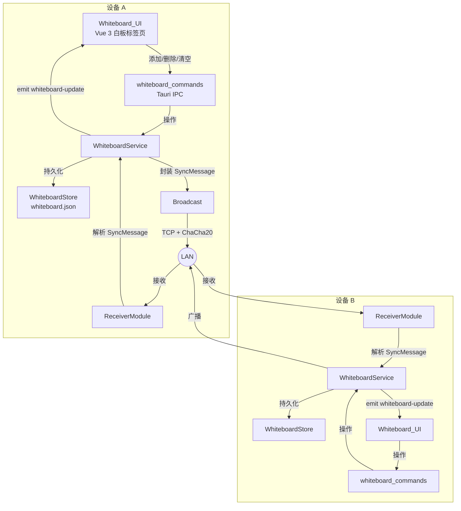

# 设计文档：共享白板

## 概述

共享白板功能为 rust-air 提供一个多设备协作的文本/图片白板区域。核心设计思路是在现有架构上做最小侵入式扩展：

- **复用 mDNS-SD 发现**：直接利用 `discovery` 模块获取在线设备列表，不新增发现协议
- **复用加密传输通道**：使用现有 `Kind::Clipboard` + ChaCha20-Poly1305 加密流传输白板同步消息，每次传输生成一次性密钥
- **新增 `whiteboard` 模块**：在 `core/src/` 中新增独立模块，负责白板内容管理、持久化、同步消息编解码
- **新增 `whiteboard_commands` 模块**：在 Tauri 命令层新增白板相关 IPC 命令
- **前端集成**：在侧边栏新增"白板"标签页，通过 Tauri 事件系统推送白板内容变更

设计目标是让用户在设备 A 上添加白板内容后，局域网内所有其他 rust-air 设备在 1 秒内收到变更并更新本地白板。通过 UUID 标识每个条目、时间戳优先策略解决冲突、全量快照实现新设备初始同步。

## 架构

### 整体架构图



### 数据流

1. **本地操作流程**：用户在 UI 中添加/删除/清空 → Tauri 命令调用 WhiteboardService → 更新内存状态 → 持久化到磁盘 → 封装 SyncMessage → 向所有已发现设备广播 → 通过 Tauri 事件通知前端更新
2. **远程同步流程**：TCP Listener 接收 `Kind::Clipboard` 数据（name 前缀为 `wb:`）→ 解密验证 → 解析 SyncMessage → WhiteboardService 合并变更 → 持久化 → 通知前端更新
3. **新设备加入流程**：新设备启动后通过 mDNS 被发现 → 已有设备检测到新设备 → 发送全量快照（snapshot 操作）→ 新设备接收并替换本地白板内容
4. **冲突解决**：所有操作携带时间戳，当收到远程 add 操作时，如果本地已存在相同 UUID 的条目，比较时间戳，保留较新的版本

## 组件与接口

### 1. WhiteboardItem（白板条目）

位于 `core/src/whiteboard.rs`，表示白板中的单个内容条目。

```rust
/// 白板内容类型
#[derive(Debug, Clone, Serialize, Deserialize, PartialEq, Eq)]
pub enum WhiteboardContentType {
    Text,
    Image,
}

/// 白板中的单个内容条目
#[derive(Debug, Clone, Serialize, Deserialize)]
pub struct WhiteboardItem {
    /// 全局唯一标识符
    pub id: String,
    /// 内容类型
    pub content_type: WhiteboardContentType,
    /// 文本内容（content_type == Text 时有值）
    pub text: Option<String>,
    /// Base64 编码的图片数据（content_type == Image 时有值）
    pub image_b64: Option<String>,
    /// 创建/修改时间戳（Unix 毫秒）
    pub timestamp: u64,
    /// 来源设备名称
    pub source_device: String,
}
```

### 2. WhiteboardSyncMessage（同步消息）

```rust
/// 同步操作类型
#[derive(Debug, Clone, Serialize, Deserialize, PartialEq, Eq)]
pub enum SyncOp {
    Add,
    Delete,
    Clear,
    Snapshot,
}

/// 白板同步消息
#[derive(Debug, Clone, Serialize, Deserialize)]
pub struct WhiteboardSyncMessage {
    /// 操作类型
    pub op: SyncOp,
    /// 发送设备名称
    pub source_device: String,
    /// 操作时间戳（Unix 毫秒）
    pub timestamp: u64,
    /// Add 操作时携带完整的 WhiteboardItem
    pub item: Option<WhiteboardItem>,
    /// Delete 操作时携带待删除条目的 UUID
    pub item_id: Option<String>,
    /// Snapshot 操作时携带完整的白板内容列表
    pub items: Option<Vec<WhiteboardItem>>,
}
```

### 3. WhiteboardStore（持久化存储）

```rust
/// 白板内容的本地持久化存储
pub struct WhiteboardStore {
    /// 内存中的白板条目列表
    pub items: Vec<WhiteboardItem>,
    /// 存储文件路径
    path: PathBuf,
    /// 是否有未保存的变更
    dirty: bool,
    /// 上次保存时间
    last_save: Instant,
}

impl WhiteboardStore {
    /// 从磁盘加载白板内容，文件不存在或损坏时返回空白板
    pub fn load() -> Self;
    
    /// 添加条目，如果已存在相同 UUID 则按时间戳决定是否替换
    pub fn add(&mut self, item: WhiteboardItem) -> bool;
    
    /// 按 UUID 删除条目，返回是否成功删除
    pub fn delete(&mut self, id: &str) -> bool;
    
    /// 清空所有条目
    pub fn clear(&mut self);
    
    /// 用快照替换全部内容
    pub fn apply_snapshot(&mut self, items: Vec<WhiteboardItem>);
    
    /// 获取所有条目的克隆（用于快照发送）
    pub fn snapshot(&self) -> Vec<WhiteboardItem>;
    
    /// 如果 dirty 且距上次保存 ≥2s，写入磁盘
    pub fn flush_if_needed(&mut self);
    
    /// 立即写入磁盘
    pub fn flush_now(&mut self);
}
```

### 4. WhiteboardService（核心服务）

WhiteboardService 不作为独立 struct，而是通过 Tauri 命令层直接操作 `WhiteboardStore`，并调用广播函数。这与现有的 `ClipboardSyncService` 模式不同，因为白板不需要 EchoGuard（白板操作是显式的用户行为，不是自动检测）。

广播逻辑直接在 Tauri 命令中实现：

```rust
/// 向所有已发现设备广播白板同步消息
pub async fn broadcast_sync_message(
    msg: &WhiteboardSyncMessage,
    devices: &[DeviceInfo],
    local_device_name: &str,
) -> Vec<BroadcastResult>;
```

### 5. Tauri 命令层（`whiteboard_commands.rs`）

```rust
pub struct WhiteboardState {
    pub store: Mutex<WhiteboardStore>,
}

/// 获取白板所有条目
#[tauri::command]
pub fn get_whiteboard_items(state: State<WhiteboardState>) -> Vec<WhiteboardItem>;

/// 添加文本条目
#[tauri::command]
pub async fn add_whiteboard_text(
    text: String,
    state: State<'_, WhiteboardState>,
    app: AppHandle,
) -> Result<WhiteboardItem, String>;

/// 添加图片条目（Base64 编码）
#[tauri::command]
pub async fn add_whiteboard_image(
    image_b64: String,
    state: State<'_, WhiteboardState>,
    app: AppHandle,
) -> Result<WhiteboardItem, String>;

/// 删除指定条目
#[tauri::command]
pub async fn delete_whiteboard_item(
    id: String,
    state: State<'_, WhiteboardState>,
    app: AppHandle,
) -> Result<(), String>;

/// 清空白板
#[tauri::command]
pub async fn clear_whiteboard(
    state: State<'_, WhiteboardState>,
    app: AppHandle,
) -> Result<(), String>;

/// 定时刷新持久化（由前端 tick 调用）
#[tauri::command]
pub fn flush_whiteboard(state: State<WhiteboardState>);
```

### 6. 与现有模块的集成点

| 现有模块 | 集成方式 |
|---------|---------|
| `discovery.rs` | 复用 `browse_devices_sync` 获取设备列表，广播时遍历已发现设备 |
| `transfer.rs` | 复用 `send_clipboard` 发送 JSON 序列化的 SyncMessage |
| `crypto.rs` | 无修改，通过 transfer 模块间接使用 ChaCha20-Poly1305 |
| `proto.rs` | 复用 `Kind::Clipboard`，通过 name 前缀 `wb:` 区分白板消息和剪贴板消息 |
| `commands.rs` | 修改 `start_listener` 中的接收处理逻辑，识别 `wb:` 前缀并路由到白板处理 |
| `App.vue` | 新增"白板"标签页，注册 `whiteboard-update` 事件监听 |

### 7. 传输协议集成

白板同步消息复用现有 v4 传输协议，通过 name 字段前缀区分：

```
name 格式: "wb:{op}:{device_name}"
  - wb:sync:DEVICE_NAME  — 携带 JSON 序列化的 WhiteboardSyncMessage
```

payload 内容为 `WhiteboardSyncMessage` 的 JSON 序列化字节。接收方在 `start_listener` 中检测 name 前缀为 `wb:` 时，路由到白板处理逻辑而非剪贴板处理逻辑。

## 数据模型

### WhiteboardItem 持久化格式

存储路径：`{data_local_dir}/rust-air/whiteboard.json`

```json
[
  {
    "id": "550e8400-e29b-41d4-a716-446655440000",
    "content_type": "Text",
    "text": "会议记录：下周三发布 v0.4",
    "image_b64": null,
    "timestamp": 1700000000000,
    "source_device": "DESKTOP-ABC"
  },
  {
    "id": "6ba7b810-9dad-11d1-80b4-00c04fd430c8",
    "content_type": "Image",
    "text": null,
    "image_b64": "iVBORw0KGgoAAAANSUhEUg...",
    "timestamp": 1700000001000,
    "source_device": "LAPTOP-XYZ"
  }
]
```

### WhiteboardSyncMessage 网络传输格式

通过现有 v4 协议传输，payload 为 JSON：

**Add 操作**：
```json
{
  "op": "Add",
  "source_device": "DESKTOP-ABC",
  "timestamp": 1700000000000,
  "item": {
    "id": "550e8400-e29b-41d4-a716-446655440000",
    "content_type": "Text",
    "text": "会议记录",
    "image_b64": null,
    "timestamp": 1700000000000,
    "source_device": "DESKTOP-ABC"
  },
  "item_id": null,
  "items": null
}
```

**Delete 操作**：
```json
{
  "op": "Delete",
  "source_device": "DESKTOP-ABC",
  "timestamp": 1700000002000,
  "item": null,
  "item_id": "550e8400-e29b-41d4-a716-446655440000",
  "items": null
}
```

**Clear 操作**：
```json
{
  "op": "Clear",
  "source_device": "DESKTOP-ABC",
  "timestamp": 1700000003000,
  "item": null,
  "item_id": null,
  "items": null
}
```

**Snapshot 操作**（新设备加入时发送）：
```json
{
  "op": "Snapshot",
  "source_device": "DESKTOP-ABC",
  "timestamp": 1700000004000,
  "item": null,
  "item_id": null,
  "items": [
    { "id": "...", "content_type": "Text", "text": "...", ... },
    { "id": "...", "content_type": "Image", "image_b64": "...", ... }
  ]
}
```

### UUID 生成

使用 `uuid` crate 的 v4 随机 UUID 生成全局唯一标识符。需要在 `core/Cargo.toml` 中添加依赖：

```toml
uuid = { version = "1", features = ["v4", "serde"] }
```

### 时间戳

所有时间戳使用 Unix 毫秒（`u64`），通过 `std::time::SystemTime::now().duration_since(UNIX_EPOCH).as_millis() as u64` 获取。冲突解决时直接比较时间戳数值，较大值（较新）优先。


## 正确性属性

*正确性属性是在系统所有有效执行中都应成立的特征或行为——本质上是对系统应做什么的形式化陈述。属性是人类可读规范与机器可验证正确性保证之间的桥梁。*

### Property 1: 添加条目使白板列表增长

*对于任意* 有效的 WhiteboardStore 和任意有效的 WhiteboardItem（文本或图片类型，UUID 不与现有条目重复），调用 `add` 后白板条目列表长度应增加 1，且新条目应出现在列表中。

**Validates: Requirements 1.2, 1.3**

### Property 2: 白板条目按时间戳排序

*对于任意* WhiteboardStore，在执行任意数量的 add 操作后，store 中的条目列表应始终按 `timestamp` 字段升序排列。

**Validates: Requirements 1.4**

### Property 3: WhiteboardItem 持久化往返

*对于任意* 有效的 WhiteboardItem 列表（包含文本和图片类型），将其序列化为 JSON 写入磁盘，再从磁盘加载反序列化，得到的列表应与原始列表在内容上完全相同（id、content_type、text、image_b64、timestamp、source_device 均相等）。

**Validates: Requirements 2.2, 2.3, 2.4**

### Property 4: SyncMessage 应用正确性

*对于任意* WhiteboardStore 状态和任意有效的 WhiteboardSyncMessage：
- 当 op 为 Add 时，应用后 store 中应包含该 item
- 当 op 为 Delete 时，应用后 store 中应不包含 item_id 对应的条目
- 当 op 为 Clear 时，应用后 store 应为空
- 当 op 为 Snapshot 时，应用后 store 的内容应与 snapshot 中的 items 完全一致

**Validates: Requirements 3.4, 4.1, 4.2, 5.3, 5.5**

### Property 5: 时间戳优先冲突解决

*对于任意* WhiteboardStore 中已存在的条目，当收到一个具有相同 UUID 但不同时间戳的 Add 操作时：如果远程时间戳更大（更新），则本地条目应被替换为远程版本；如果远程时间戳更小（更旧），则本地条目应保持不变。

**Validates: Requirements 4.4**

### Property 6: WhiteboardSyncMessage JSON 序列化往返

*对于任意* 有效的 WhiteboardSyncMessage（覆盖 Add、Delete、Clear、Snapshot 四种操作类型），将其序列化为 JSON 字节再反序列化，得到的消息应与原始消息在语义上完全等价。同时，Add 消息的 item 字段必须为 Some，Delete 消息的 item_id 字段必须为 Some。

**Validates: Requirements 6.1, 6.3, 6.4, 6.5**

### Property 7: 快照包含完整白板内容

*对于任意* WhiteboardStore 状态，调用 `snapshot()` 返回的条目列表应与 store 中的 `items` 完全一致（数量相同、每个条目的所有字段相等）。

**Validates: Requirements 7.4**

## 错误处理

| 错误场景 | 处理方式 |
|---------|---------|
| 目标设备连接失败 | 记录 warn 日志，跳过该设备，继续向其他设备广播。不影响整体广播流程 |
| 加密握手/传输失败 | 中止该次传输，记录 error 日志，通过 Tauri 事件 `whiteboard-error` 通知前端 |
| SHA-256 校验失败 | 丢弃该 SyncMessage，不合并到本地白板，记录 error 日志 |
| SyncMessage JSON 解析失败 | 丢弃该消息，记录 warn 日志，不影响后续接收 |
| 白板存储文件损坏或不存在 | 使用空白板初始化，记录 warn 日志 |
| 白板存储文件写入失败 | 记录 error 日志，保持内存状态不变，下次 flush 时重试 |
| 图片 Base64 解码失败 | 跳过该条目，记录 warn 日志 |
| UUID 冲突（极低概率） | 按时间戳优先策略处理，较新的版本覆盖较旧的版本 |

### 错误事件格式

```rust
#[derive(Debug, Clone, Serialize)]
pub struct WhiteboardError {
    /// 错误类型: "sync_failed" | "parse_failed" | "storage_failed"
    pub kind: String,
    /// 用户可读的错误描述
    pub message: String,
    /// 相关设备名（如适用）
    pub device: Option<String>,
}
```

通过 `app.emit("whiteboard-error", &error)` 推送到前端，前端显示 3 秒的 toast 通知。

## 测试策略

### 属性测试（Property-Based Testing）

使用 `proptest` 库（已在 `core/Cargo.toml` 的 dev-dependencies 中配置）实现正确性属性验证。

**配置**：
- 每个属性测试最少运行 100 次迭代
- 每个测试用 `// Feature: shared-whiteboard, Property N: ...` 注释标注对应的设计属性

**测试文件**：`core/tests/whiteboard_test.rs`

**覆盖的属性**：
- Property 1: 添加条目使白板列表增长
- Property 2: 白板条目按时间戳排序
- Property 3: WhiteboardItem 持久化往返（JSON 序列化/反序列化）
- Property 4: SyncMessage 应用正确性（Add/Delete/Clear/Snapshot）
- Property 5: 时间戳优先冲突解决
- Property 6: WhiteboardSyncMessage JSON 序列化往返
- Property 7: 快照包含完整白板内容

**属性测试标签格式**：`Feature: shared-whiteboard, Property {number}: {property_text}`

### 单元测试

**测试文件**：`core/src/whiteboard.rs` 内的 `#[cfg(test)] mod tests`

- 具体示例：空文本添加、超长文本、特殊 Unicode 字符（emoji、CJK）
- 边界条件：空白板上的删除操作、删除不存在的 UUID、重复添加相同 UUID
- 存储文件不存在时的默认行为
- 存储文件为空字符串、无效 JSON、截断 JSON 时的容错行为
- Clear 操作后立即 Add 的正确性

### 集成测试

- 端到端加密传输：两个 TCP 端点之间发送/接收 WhiteboardSyncMessage
- 新设备加入时的全量快照同步流程
- 多设备并发操作的冲突解决
- 前端事件：验证 `whiteboard-update` 和 `whiteboard-error` 事件正确触发

### 属性测试库配置

```toml
# core/Cargo.toml [dev-dependencies] — 已存在
proptest = "1"

# core/Cargo.toml [dependencies] — 需新增
uuid = { version = "1", features = ["v4", "serde"] }
```
