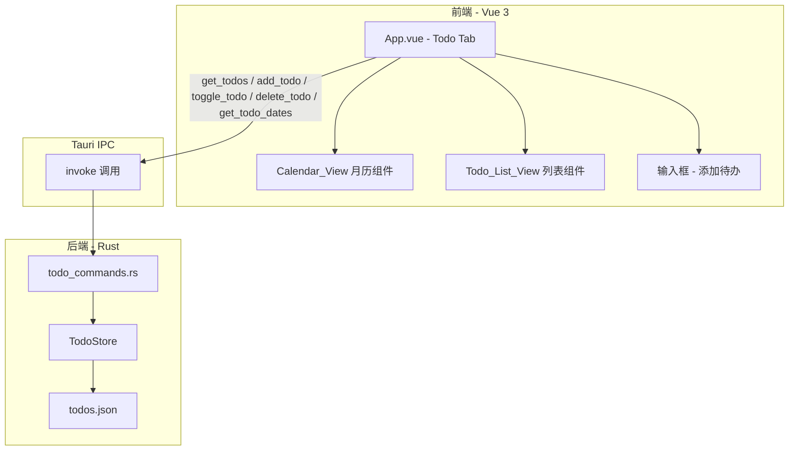

# 设计文档：TodoList + 日历功能

## 概述

在 rust-air 应用首页侧边栏新增一个"待办"Tab，集成月历视图与待办事项列表。用户可通过日历选择日期，查看、添加、完成和删除该日期下的待办事项。

数据流采用前后端分离架构：Vue 3 前端通过 Tauri IPC `invoke` 调用 Rust 后端命令，Rust 后端负责 JSON 文件的读写和数据校验。前端不直接操作文件系统，所有持久化操作由后端完成。

技术选型：
- 前端：Vue 3 Composition API + Tailwind CSS 4，内联在 `App.vue` 中（与现有 Tab 一致）
- 后端：Rust + serde_json，新增 `todo_commands.rs` 模块
- 存储：应用数据目录下的 `todos.json` 文件
- ID 生成：使用时间戳 + 随机数生成 u64 唯一标识符（与现有 `clip_history_commands.rs` 中的模式一致，避免引入新依赖）

## 架构



数据流：
1. 用户在前端操作（点击日期、添加/完成/删除待办）
2. 前端通过 `invoke` 调用对应的 Rust 命令
3. Rust 后端执行数据操作并持久化到 `todos.json`
4. 后端返回更新后的数据，前端刷新视图

## 组件与接口

### Rust 后端接口

#### TodoStore 状态管理

```rust
pub struct TodoStore {
    items: Vec<TodoItem>,
    path: PathBuf,
}
```

通过 `Mutex<TodoStore>` 作为 Tauri managed state 注入，与现有 `HistoryState` 模式一致。

#### Tauri IPC 命令

| 命令 | 参数 | 返回值 | 说明 |
|------|------|--------|------|
| `get_todos` | `date: String` (YYYY-MM-DD) | `Vec<TodoItemView>` | 获取指定日期的待办列表 |
| `add_todo` | `title: String, date: String` | `TodoItemView` | 添加新待办，返回创建的项 |
| `toggle_todo` | `id: u64` | `TodoItemView` | 切换完成状态，返回更新后的项 |
| `delete_todo` | `id: u64` | `()` | 删除指定待办 |
| `get_todo_dates` | `year: i32, month: u32` | `Vec<String>` | 返回该月有未完成待办的日期列表 |

#### 错误处理

所有命令返回 `Result<T, String>`，文件 I/O 错误通过 `.map_err(|e| e.to_string())` 转换为字符串错误信息返回前端。

### Vue 前端组件

所有逻辑内联在 `App.vue` 中（与现有 Tab 一致），不拆分独立 `.vue` 文件。

#### 状态定义

```typescript
// Tab 类型扩展
type Tab = "send" | "receive" | "devices" | "search" | "sync" | "todo" | "settings";

// 待办事项类型
interface TodoItem {
  id: number;
  title: string;
  date: string;       // YYYY-MM-DD
  completed: boolean;
}

// 日历状态
const selectedDate = ref<string>(todayStr());      // 当前选中日期
const calendarYear = ref(new Date().getFullYear()); // 日历显示年份
const calendarMonth = ref(new Date().getMonth() + 1); // 日历显示月份 (1-12)
const todos = ref<TodoItem[]>([]);                  // 当前日期的待办列表
const todoDates = ref<string[]>([]);                // 当月有未完成待办的日期
const newTodoTitle = ref("");                       // 输入框内容
```

#### 键盘快捷键

扩展现有 `TAB_KEYS` 映射，添加 `"6": "todo"`。

#### 日历渲染逻辑

纯前端计算，不依赖第三方日历库：
- 根据 `calendarYear` 和 `calendarMonth` 计算当月天数和第一天的星期
- 生成 6×7 网格（含上月末尾和下月开头的灰色日期）
- 当天日期高亮、选中日期高亮、有未完成待办的日期显示圆点

## 数据模型

### TodoItem（Rust 结构体）

```rust
#[derive(Serialize, Deserialize, Clone)]
pub struct TodoItem {
    pub id: u64,
    pub title: String,
    pub date: String,        // "YYYY-MM-DD"
    pub completed: bool,
}
```

### TodoItemView（前端传输结构）

与 `TodoItem` 结构相同，直接序列化传输。

### todos.json 存储格式

```json
{
  "items": [
    {
      "id": 1719000000001,
      "title": "完成设计文档",
      "date": "2025-01-15",
      "completed": false
    }
  ]
}
```

### 日期格式

统一使用 `YYYY-MM-DD` 字符串格式，前后端一致，避免时区问题。


## 正确性属性

*属性是在系统所有有效执行中都应成立的特征或行为——本质上是对系统应做什么的形式化陈述。属性是人类可读规格说明与机器可验证正确性保证之间的桥梁。*

### 属性 1：序列化往返一致性

*对于任意*有效的 `Vec<TodoItem>` 列表，将其序列化为 JSON 字符串后再反序列化，应产生与原始列表等价的结果。

**验证需求：1.6**

### 属性 2：ID 唯一性

*对于任意*一组通过 `add_todo` 创建的 TodoItem，所有生成的 ID 应互不相同。

**验证需求：1.5**

### 属性 3：日期过滤正确性

*对于任意*一组 TodoItem 和任意日期字符串，`get_todos(date)` 返回的所有项的 `date` 字段应等于请求的日期，且不遗漏任何匹配项。

**验证需求：3.1, 8.1**

### 属性 4：添加待办正确性

*对于任意*非空非纯空白的标题字符串和有效日期，`add_todo(title, date)` 应返回一个 `completed=false`、`title` 和 `date` 与输入匹配的 TodoItem，且该项应出现在对应日期列表的顶部。

**验证需求：4.2, 4.5, 8.2**

### 属性 5：空白标题拒绝

*对于任意*仅由空白字符组成的字符串，`add_todo` 应拒绝该输入，待办列表应保持不变。

**验证需求：4.4**

### 属性 6：完成状态切换是对合映射

*对于任意* TodoItem，调用 `toggle_todo` 一次应翻转其 `completed` 字段；调用两次应恢复原始状态。

**验证需求：3.3, 8.3**

### 属性 7：列表排序不变量

*对于任意*日期的待办列表，`get_todos` 返回的结果中所有未完成项应排在所有已完成项之前。

**验证需求：3.4**

### 属性 8：删除移除正确性

*对于任意*存在于存储中的 TodoItem，调用 `delete_todo(id)` 后，该 ID 的项应不再出现在任何查询结果中，且其他项不受影响。

**验证需求：5.2, 8.4**

### 属性 9：未完成待办日期标记正确性

*对于任意*一组 TodoItem 和任意年月，`get_todo_dates(year, month)` 返回的日期集合应恰好等于该月中存在至少一个 `completed=false` 的 TodoItem 的日期集合。

**验证需求：2.5, 5.3, 8.5**

### 属性 10：月份导航正确性

*对于任意*年份和月份，"下一月"操作应将月份加 1（12 月时翻转为下一年 1 月），"上一月"操作应将月份减 1（1 月时翻转为上一年 12 月）。

**验证需求：2.4**

## 错误处理

| 场景 | 处理方式 |
|------|----------|
| `todos.json` 不存在 | 创建空列表，生成新文件 |
| `todos.json` 内容损坏（无效 JSON） | 记录警告日志，创建空列表，覆盖写入新文件 |
| 文件读写 I/O 错误 | 返回 `Err(String)` 给前端，前端显示错误提示 |
| `add_todo` 标题为空白 | 返回 `Err("标题不能为空")` |
| `toggle_todo` / `delete_todo` ID 不存在 | 返回 `Err("待办事项不存在")` |
| 日期格式无效 | 返回 `Err("日期格式无效")` |

前端错误处理策略：
- `invoke` 调用使用 `try/catch`，捕获错误后通过临时提示（toast）展示给用户
- 不阻断用户操作流程，错误提示 3 秒后自动消失

## 测试策略

### 属性测试（Property-Based Testing）

使用 Rust 的 `proptest` 库对后端核心逻辑进行属性测试。

配置要求：
- 每个属性测试最少运行 100 次迭代
- 每个测试用注释标注对应的设计文档属性
- 标注格式：**Feature: todolist-calendar, Property {编号}: {属性描述}**

测试范围：
- 属性 1（序列化往返）：生成随机 TodoItem 列表，验证 JSON 序列化/反序列化往返一致性
- 属性 2（ID 唯一性）：批量调用 add_todo，验证所有 ID 互不相同
- 属性 3（日期过滤）：生成跨多日期的随机 TodoItem，验证 get_todos 过滤正确性
- 属性 4（添加正确性）：生成随机有效标题和日期，验证返回值和列表位置
- 属性 5（空白拒绝）：生成随机空白字符串，验证拒绝行为
- 属性 6（切换对合）：生成随机 TodoItem，验证双次切换恢复原状
- 属性 7（排序不变量）：生成混合完成状态的列表，验证排序
- 属性 8（删除正确性）：生成随机列表并删除随机项，验证移除且不影响其他项
- 属性 9（日期标记）：生成跨月的随机 TodoItem，验证 get_todo_dates 返回正确日期集
- 属性 10（月份导航）：生成随机年月，验证前进/后退逻辑

### 单元测试

- 后端：`TodoStore` 的加载、保存、损坏文件恢复等边界场景
- 前端：日历网格生成逻辑（天数计算、星期偏移）的具体示例测试

### 集成测试

- 通过 Tauri IPC 调用完整的 CRUD 流程
- 验证文件持久化（写入后重新加载）
