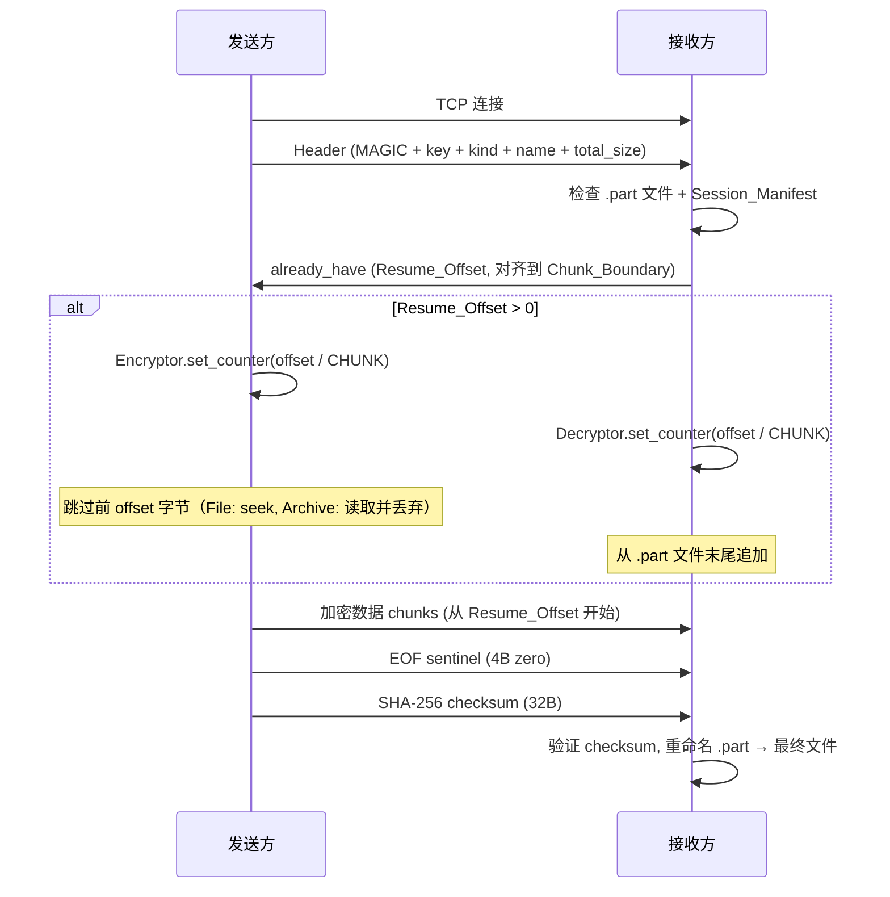
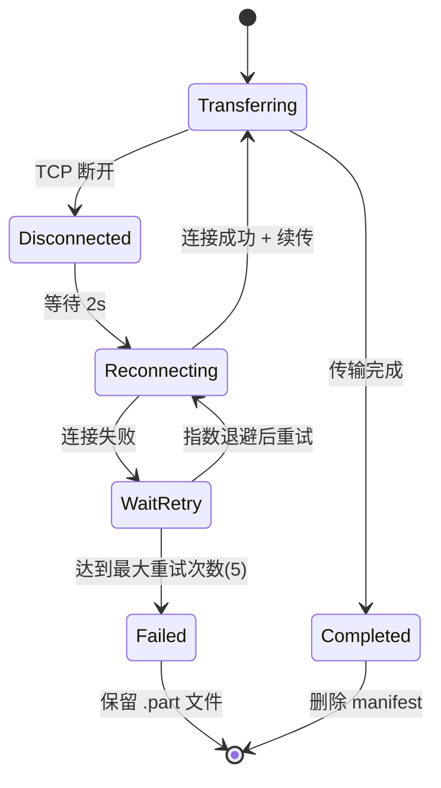

# 设计文档：断点续传功能

## 概述

本设计为 rust-air 的传输引擎（`core/src/transfer.rs`）添加完整的断点续传支持，涵盖 Archive（目录）传输续传、加密 nonce counter 对齐、自动重连机制、会话持久化以及前端状态展示。

当前实现中，单文件续传已有基础逻辑：接收方检查 `.part` 文件大小并发送 `already_have` 偏移量。本设计在此基础上扩展，使 Archive 传输也支持续传，并引入自动重连、会话 manifest 持久化和 `TransferEvent` 扩展。

核心设计原则：
- 保持协议 v4 的 wire format 不变，续传逻辑完全在应用层处理
- 加密 nonce counter 必须与 frame 位置严格对齐，确保续传拼接后的数据流与一次性传输等价
- Archive 续传通过重新生成归档流并跳过已发送字节实现（因为 tar+zstd 流不可 seek）
- 自动重连使用指数退避策略，最多 5 次

## 架构

### 整体流程



### 自动重连流程



### 模块变更范围

| 模块 | 文件 | 变更内容 |
|------|------|----------|
| proto | `core/src/proto.rs` | 扩展 `TransferEvent`，新增 `SessionManifest` 结构体 |
| crypto | `core/src/crypto.rs` | `Encryptor`/`Decryptor` 添加 `set_counter()` 方法 |
| transfer | `core/src/transfer.rs` | Archive 续传逻辑、自动重连、manifest 读写 |
| frontend | `tauri-app/src/App.vue` | 续传状态展示、重连 UI、重试按钮 |
| commands | `tauri-app/src-tauri/src/commands.rs` | 传递扩展后的 TransferEvent 到前端 |

## 组件与接口

### 1. Encryptor / Decryptor 扩展 (`core/src/crypto.rs`)

```rust
impl<W: AsyncWrite + Unpin> Encryptor<W> {
    /// 设置初始 frame counter，用于续传时跳过已发送的 frame。
    /// 必须在第一次 write_chunk() 调用之前设置。
    pub fn set_counter(&mut self, counter: u64) {
        self.counter = counter;
    }
}

impl<R: AsyncRead + Unpin> Decryptor<R> {
    /// 设置初始 frame counter，用于续传时跳过已接收的 frame。
    /// 必须在第一次 read_chunk() 调用之前设置。
    pub fn set_counter(&mut self, counter: u64) {
        self.counter = counter;
    }
}
```

### 2. SessionManifest (`core/src/proto.rs`)

```rust
/// 传输会话元数据，用于续传时验证和恢复状态。
#[derive(Debug, Clone, Serialize, Deserialize)]
pub struct SessionManifest {
    /// 传输文件/目录名称
    pub name: String,
    /// 传输总大小（字节）
    pub total_size: u64,
    /// 传输类型
    pub kind: Kind,
    /// 发送方地址 "ip:port"
    pub sender_addr: String,
    /// 创建时间戳 (Unix epoch seconds)
    pub created_at: u64,
}
```

### 3. TransferEvent 扩展 (`core/src/proto.rs`)

```rust
#[derive(Debug, Clone, Serialize, Deserialize)]
pub struct TransferEvent {
    pub bytes_done:    u64,
    pub total_bytes:   u64,
    pub bytes_per_sec: u64,
    pub done:          bool,
    pub error:         Option<String>,
    /// 是否为续传模式
    pub resumed:       bool,
    /// 续传跳过的字节数
    pub resume_offset: u64,
    /// 重连信息（仅在重连过程中有值）
    pub reconnect_info: Option<ReconnectInfo>,
}

#[derive(Debug, Clone, Serialize, Deserialize)]
pub struct ReconnectInfo {
    /// 当前重连次数 (1-based)
    pub attempt: u32,
    /// 最大重连次数
    pub max_attempts: u32,
}
```

### 4. 自动重连模块 (`core/src/transfer.rs`)

```rust
/// 重连配置常量
const MAX_RECONNECT_ATTEMPTS: u32 = 5;
const INITIAL_RETRY_DELAY_SECS: u64 = 2;

/// 带自动重连的接收函数。
/// 当 TCP 连接断开时，自动尝试重新连接并利用 .part 文件续传。
pub async fn receive_with_reconnect(
    addr: std::net::SocketAddr,
    dest: &Path,
    cancel_token: tokio_util::sync::CancellationToken,
    on_progress: impl Fn(TransferEvent) + Send + 'static,
) -> Result<PathBuf>;
```

### 5. Manifest 读写辅助函数 (`core/src/transfer.rs`)

```rust
/// 获取 manifest 文件路径
fn manifest_path(dest: &Path, name: &str) -> PathBuf {
    dest.join(format!("{name}.manifest.json"))
}

/// 写入 session manifest
async fn write_manifest(path: &Path, manifest: &SessionManifest) -> Result<()>;

/// 读取 session manifest，解析失败返回 None
async fn read_manifest(path: &Path) -> Option<SessionManifest>;

/// 删除 session manifest
async fn remove_manifest(path: &Path);
```

## 数据模型

### Session Manifest JSON 格式

```json
{
  "name": "my-project",
  "total_size": 1073741824,
  "kind": "Archive",
  "sender_addr": "192.168.1.100:9527",
  "created_at": 1719000000
}
```

存储位置：`{dest}/{name}.manifest.json`，与 `.part` 文件同目录。

### 续传状态判定逻辑

| 条件 | 行为 |
|------|------|
| 无 `.part` 文件 | 全新传输，`Resume_Offset = 0` |
| 有 `.part` 但无 manifest | 全新传输，删除旧 `.part` |
| 有 `.part` + manifest，但 name/total_size 不匹配 | 全新传输，删除旧 `.part` 和 manifest |
| 有 `.part` + manifest，且匹配 | 续传，`Resume_Offset = part_size 对齐到 CHUNK` |
| manifest 解析失败 | 全新传输，删除旧 `.part` 和 manifest |

### 重连指数退避时间表

| 重试次数 | 延迟 |
|----------|------|
| 1 | 2 秒 |
| 2 | 4 秒 |
| 3 | 8 秒 |
| 4 | 16 秒 |
| 5 | 32 秒 |

总最大等待时间：62 秒。

### Nonce Counter 对齐公式

```
frame_counter_initial = resume_offset / CHUNK
```

其中 `resume_offset` 已对齐到 `CHUNK`（256 KB）边界，因此 `frame_counter_initial` 始终为整数。发送方和接收方必须使用相同的初始值，确保每个 frame 的 nonce 与完整传输时一致。


## 正确性属性

*属性（Property）是在系统所有有效执行中都应成立的特征或行为——本质上是对系统应做什么的形式化陈述。属性是人类可读规格说明与机器可验证正确性保证之间的桥梁。*

### Property 1: Resume_Offset 块对齐

*For any* `.part` 文件大小 `file_size`（u64），计算得到的 `Resume_Offset` 应等于 `(file_size / CHUNK) * CHUNK`，且始终满足 `Resume_Offset <= file_size` 和 `Resume_Offset % CHUNK == 0`。

**Validates: Requirements 1.2**

### Property 2: Manifest 不匹配检测

*For any* 两个 `SessionManifest` 实例（已存储的和新传入的），当且仅当 `name` 和 `total_size` 都相等时，系统应判定为匹配并进入续传模式；否则应判定为不匹配并从头开始传输。

**Validates: Requirements 1.5**

### Property 3: Nonce Counter 初始化对齐

*For any* CHUNK 对齐的 `Resume_Offset`，Encryptor 和 Decryptor 的 `Frame_Counter` 初始值应等于 `Resume_Offset / CHUNK`。设置后，第一个加密/解密的 frame 使用的 nonce 应与完整传输中该位置 frame 的 nonce 一致。

**Validates: Requirements 2.1, 2.2**

### Property 4: 续传加密等价性（Round-Trip）

*For any* 明文数据流和任意 CHUNK 对齐的 `Resume_Offset`，将数据流完整加密得到的密文，与分两段加密（前缀使用 counter 从 0 开始，后缀使用 counter 从 `Resume_Offset / CHUNK` 开始）得到的密文，在后缀部分应逐字节相同。即：续传拼接后的加密流与一次性完整传输的加密流等价。

**Validates: Requirements 2.5**

### Property 5: 指数退避延迟计算

*For any* 重连尝试次数 `n`（1 ≤ n ≤ 5），重连延迟应等于 `2^n` 秒。

**Validates: Requirements 3.2**

### Property 6: SessionManifest 序列化 Round-Trip

*For any* 有效的 `SessionManifest` 实例，将其序列化为 JSON 再反序列化，应得到与原始实例等价的对象。

**Validates: Requirements 4.2**

### Property 7: 非续传场景默认字段

*For any* 全新传输（`Resume_Offset == 0`）产生的 `TransferEvent`，`resumed` 字段应为 `false`，`resume_offset` 字段应为 `0`。

**Validates: Requirements 7.4**

## 错误处理

### 传输层错误

| 错误场景 | 处理方式 |
|----------|----------|
| TCP 连接断开 | 触发自动重连流程，保留 `.part` 文件 |
| 所有重连尝试失败 | 通过 `TransferEvent.error` 报告错误，保留 `.part` 和 manifest |
| SHA-256 校验失败 | 删除 `.part` 文件和 manifest，报告数据损坏错误 |
| 解密失败（nonce 不匹配） | 删除 `.part` 文件和 manifest，报告加密错误，从头重传 |

### Manifest 错误

| 错误场景 | 处理方式 |
|----------|----------|
| Manifest JSON 解析失败 | 忽略 manifest，删除 `.part` 文件，从头传输 |
| Manifest 与传输参数不匹配 | 删除旧 `.part` 和 manifest，从头传输 |
| Manifest 文件 I/O 错误 | 记录警告日志，按无 manifest 处理 |

### 重连错误

| 错误场景 | 处理方式 |
|----------|----------|
| 用户取消 | 立即停止重连，保留 `.part` 和 manifest |
| 发送方不可达 | 按指数退避重试，最多 5 次 |
| 发送方拒绝连接 | 同上 |

## 测试策略

### 属性测试（Property-Based Testing）

使用 `proptest` crate 进行属性测试，每个属性至少运行 100 次迭代。

| 属性 | 测试描述 | 标签 |
|------|----------|------|
| Property 1 | 生成随机 u64 文件大小，验证对齐公式 | `Feature: transfer-resume, Property 1: Resume_Offset chunk alignment` |
| Property 2 | 生成随机 manifest 对，验证匹配/不匹配判定 | `Feature: transfer-resume, Property 2: Manifest mismatch detection` |
| Property 3 | 生成随机 CHUNK 对齐偏移量，验证 counter 初始化 | `Feature: transfer-resume, Property 3: Nonce counter initialization` |
| Property 4 | 生成随机明文和偏移量，验证续传加密等价性 | `Feature: transfer-resume, Property 4: Encryption resume equivalence` |
| Property 5 | 对 n=1..5 验证延迟 = 2^n 秒 | `Feature: transfer-resume, Property 5: Exponential backoff delay` |
| Property 6 | 生成随机 SessionManifest，验证 JSON round-trip | `Feature: transfer-resume, Property 6: SessionManifest round-trip` |
| Property 7 | 生成随机全新传输事件，验证默认字段 | `Feature: transfer-resume, Property 7: Fresh transfer defaults` |

### 单元测试

- Encryptor/Decryptor `set_counter()` 方法基本功能验证
- `manifest_path()` 路径生成
- `read_manifest()` 处理损坏文件（edge case）
- `unique_path()` 在续传场景下的行为

### 集成测试

- 完整的单文件续传流程（中断 → 重连 → 完成）
- 完整的 Archive 续传流程（中断 → 重连 → 完成）
- 自动重连 5 次失败后的行为
- 用户取消传输时的清理行为
- Manifest 不匹配时的重新传输行为
