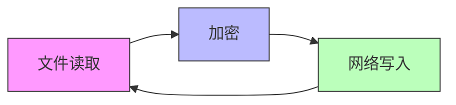
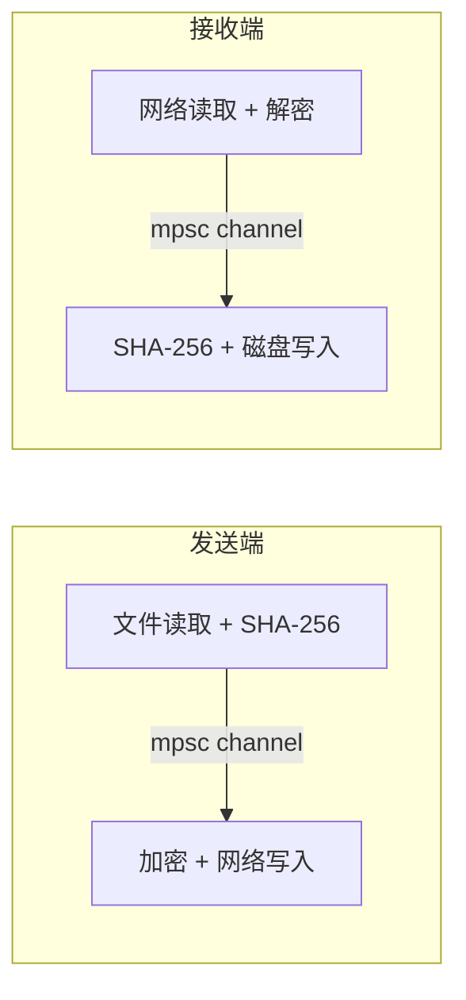

# 设计文档：传输速度优化（transfer-speed-boost）

## 概述

本设计旨在将 rust-air 的局域网传输吞吐量从当前 ~12MB/s 提升至 60MB/s+。优化涵盖五个层面：增大 CHUNK 大小、发送端流水线加密、TCP socket 调优、增大接收端 BufWriter 容量、接收端流水线解密。同时优化进度回调频率以减少开销。

核心设计原则：
- 保持 v4 协议线格式完全兼容（帧格式 `[4B len][16B tag][ciphertext]` 不变）
- 保持 ChaCha20-Poly1305 AEAD 安全性（nonce 单调递增）
- 保持 SHA-256 端到端校验完整性
- 所有优化对上层 API 透明，`send_path` / `receive_to_disk` 签名不变

## 架构

### 当前架构（串行）



当前流程是严格串行的：读取一个 256KB chunk → 加密 → 写入网络 → 读取下一个 chunk。CPU 和 I/O 无法重叠。

### 目标架构（流水线）



发送端：文件读取在独立 task 中运行，通过 bounded channel 将数据块传递给加密+写入 task。
接收端：网络读取+解密在主 task 中运行，通过 bounded channel 将解密后的数据块传递给磁盘写入 task。

### 优化层次总览

| 层次 | 当前值 | 目标值 | 预期收益 |
|------|--------|--------|----------|
| CHUNK 大小 | 256KB | 1MB | 减少 4x 加密/系统调用次数 |
| 发送端流水线 | 串行 | 双缓冲 channel | 读取与加密重叠 |
| TCP 缓冲区 | OS 默认 | 2MB send/recv | 减少网络延迟 |
| BufWriter 容量 | 1MB (4×256KB) | 4MB (4×1MB) | 减少磁盘写入次数 |
| 接收端流水线 | 串行 | channel 解耦 | 解密与写入重叠 |
| 进度回调间隔 | 50ms | 100ms | 减少回调开销 |

## 组件与接口

### 1. `proto.rs` — 常量变更

```rust
// 变更前
pub const CHUNK: usize = 256 * 1024;

// 变更后
pub const CHUNK: usize = 1024 * 1024; // 1MB
```

CHUNK 是全局常量，`Encryptor`、`Decryptor`、`transfer.rs` 中所有 `Vec::with_capacity` 和 buffer 分配都引用它，改一处即可。

### 2. `crypto.rs` — 缓冲区自动适配

`Encryptor::new` 和 `Decryptor::new` 已使用 `CHUNK` 常量进行预分配，无需额外修改：

```rust
// Encryptor — frame_buf 容量自动跟随 CHUNK
frame_buf: Vec::with_capacity(4 + 16 + CHUNK),

// Decryptor — data_buf 和 spare_buf 容量自动跟随 CHUNK
data_buf: Vec::with_capacity(CHUNK),
spare_buf: Vec::with_capacity(CHUNK),
```

加密/解密逻辑、nonce 构造、帧格式均不受 CHUNK 大小影响。

### 3. `transfer.rs` — 发送端流水线

#### 设计决策：`tokio::sync::mpsc` vs 双缓冲 swap

选择 `tokio::sync::mpsc::channel` 方案：
- bounded channel 容量为 2，实现自然的背压控制
- 读取 task 通过 `spawn` 独立运行，与加密 task 并行
- channel 语义清晰，错误传播简单

#### 发送端流水线实现

```rust
// stream_encrypted_hash 重构为流水线版本
async fn stream_encrypted_hash_pipeline<R: AsyncRead + Unpin + Send + 'static>(
    reader: R,
    enc: &mut Encryptor<impl AsyncWriteExt + Unpin>,
    initial: u64,
    total: u64,
    on_progress: Arc<impl Fn(TransferEvent) + Send + Sync>,
    mut hasher: Sha256,
) -> Result<[u8; 32]> {
    let (tx, mut rx) = tokio::sync::mpsc::channel::<Result<Vec<u8>>>(2);

    // 读取 task：独立 spawn，读满 CHUNK 后发送
    let read_task = tokio::spawn(async move {
        let mut reader = reader;
        loop {
            let mut buf = vec![0u8; CHUNK];
            let mut filled = 0;
            while filled < buf.len() {
                match reader.read(&mut buf[filled..]).await {
                    Ok(0) => break,
                    Ok(n) => filled += n,
                    Err(e) => { let _ = tx.send(Err(e.into())).await; return; }
                }
            }
            if filled == 0 { break; }
            buf.truncate(filled);
            if tx.send(Ok(buf)).await.is_err() { break; }
        }
    });

    // 加密+写入 task：从 channel 接收，顺序哈希+加密
    let mut done = initial;
    let start = Instant::now();
    let mut last_emit = start;
    while let Some(result) = rx.recv().await {
        let chunk = result?;
        hasher.update(&chunk);
        enc.write_chunk(&chunk).await?;
        done += chunk.len() as u64;
        if last_emit.elapsed().as_millis() >= 100 {
            emit_progress(&on_progress, done, total, &start, false);
            last_emit = Instant::now();
        }
    }
    read_task.await.map_err(|e| anyhow::anyhow!("read task panicked: {e}"))?;
    Ok(hasher.finalize().into())
}
```

关键设计点：
- SHA-256 在加密 task 中顺序计算，保证哈希顺序正确
- Encryptor 的 nonce counter 在单一 task 中递增，保证单调性
- channel 容量为 2，最多预读 2 个 chunk（2MB），内存可控
- 读取 task 中的错误通过 channel 传播到加密 task

### 4. `transfer.rs` — 接收端流水线

```rust
// receive_to_disk 的 Kind::File 分支重构
// 解密在主 task，磁盘写入通过 channel 分离
let (write_tx, mut write_rx) = tokio::sync::mpsc::channel::<Vec<u8>>(2);

let write_task = tokio::spawn(async move {
    while let Some(chunk) = write_rx.recv().await {
        f.write_all(&chunk).await?;
    }
    f.flush().await?;
    Ok::<_, anyhow::Error>(())
});

// 主 task：解密 + SHA-256 + 发送到写入 channel
while let Some(chunk) = dec.read_chunk().await? {
    hasher.update(&chunk);
    done += chunk.len() as u64;
    write_tx.send(chunk).await
        .map_err(|_| anyhow::anyhow!("write task failed"))?;
    if last_emit.elapsed().as_millis() >= 100 {
        emit_progress(&on_progress, done, total_size, &start, false);
        last_emit = Instant::now();
    }
}
drop(write_tx);
write_task.await??;
```

关键设计点：
- SHA-256 在解密 task 中顺序计算（解密后立即哈希），保证顺序正确
- 解密后的 chunk 所有权转移给写入 task，避免拷贝
- 注意：接收端流水线中不再使用 `dec.recycle()`，因为 chunk 所有权已转移。这会导致 Decryptor 每帧分配新 buffer，但 1MB chunk 下分配频率降低 4x，影响可忽略

### 5. TCP Socket 调优

新增 `tune_socket` 辅助函数：

```rust
use socket2::SockRef;

fn tune_socket(stream: &TcpStream) {
    let sock = SockRef::from(stream);
    if let Err(e) = stream.set_nodelay(true) {
        eprintln!("warn: TCP_NODELAY failed: {e}");
    }
    let buf_size = 2 * 1024 * 1024; // 2MB
    if let Err(e) = sock.set_send_buffer_size(buf_size) {
        eprintln!("warn: SO_SNDBUF failed: {e}");
    }
    if let Err(e) = sock.set_recv_buffer_size(buf_size) {
        eprintln!("warn: SO_RCVBUF failed: {e}");
    }
}
```

在 `send_path` 和 `receive_to_disk` 的入口处、`stream.into_split()` 之前调用。

依赖：需要在 `core/Cargo.toml` 中添加 `socket2 = "0.5"`。

`tokio::net::TcpStream` 可通过 `AsRawFd` / `AsRawSocket` 获取底层 fd，`socket2::SockRef::from` 可以从引用创建而不获取所有权。

### 6. BufWriter 容量

```rust
// 变更前
let mut f = BufWriter::with_capacity(4 * CHUNK, file);
// CHUNK=256KB → 4*256KB = 1MB

// 变更后（CHUNK=1MB 后自动变为 4MB）
let mut f = BufWriter::with_capacity(4 * CHUNK, file);
// CHUNK=1MB → 4*1MB = 4MB
```

由于 BufWriter 容量已表达为 `4 * CHUNK`，CHUNK 增大后容量自动跟随，无需额外修改。

### 7. 进度回调间隔

```rust
// 变更前
if last_emit.elapsed().as_millis() >= 50 {

// 变更后
if last_emit.elapsed().as_millis() >= 100 {
```

所有 `emit_progress` 调用点（`stream_encrypted_hash`、`receive_to_disk` 的 File/Archive 分支）统一改为 100ms。

## 数据模型

本次优化不引入新的数据结构或持久化格式变更。

### 受影响的常量

| 常量/参数 | 位置 | 变更前 | 变更后 |
|-----------|------|--------|--------|
| `CHUNK` | `proto.rs` | 256KB | 1MB |
| 进度回调间隔 | `transfer.rs` | 50ms | 100ms |
| TCP_NODELAY | 新增 | 未设置 | true |
| SO_SNDBUF | 新增 | OS 默认 | 2MB |
| SO_RCVBUF | 新增 | OS 默认 | 2MB |

### 内存使用变化

| 组件 | 变更前 | 变更后 |
|------|--------|--------|
| Encryptor frame_buf | ~260KB | ~1MB |
| Decryptor data_buf + spare_buf | ~512KB | ~2MB |
| 发送端 channel (2 slots) | 无 | ~2MB |
| 接收端 channel (2 slots) | 无 | ~2MB |
| BufWriter | 1MB | 4MB |
| TCP send buffer | OS 默认 (~128KB) | 2MB |
| TCP recv buffer | OS 默认 (~128KB) | 2MB |
| **总增量** | ~2MB | ~13MB |

总内存增量约 11MB，对于桌面/移动应用完全可接受。

## 正确性属性

*正确性属性是在系统所有有效执行中都应成立的特征或行为——本质上是对系统应做什么的形式化陈述。属性是人类可读规范与机器可验证正确性保证之间的桥梁。*

### 属性 1：加密解密往返一致性

*对于任意*有效的明文数据（长度从 0 到多个 CHUNK），使用 Encryptor 加密后再使用 Decryptor 解密，应当产生与原始明文完全相同的数据。

**验证需求：1.4, 2.4, 5.2**

### 属性 2：流水线 SHA-256 完整性

*对于任意*输入数据，通过发送端流水线（读取 → channel → 加密 task 中顺序哈希）计算的 SHA-256 值，应当等于直接对原始数据计算的 SHA-256 值。

**验证需求：2.3, 5.3**

### 属性 3：进度回调节流

*对于任意*传输过程中产生的连续两个非终止进度回调事件，它们之间的时间间隔应当不小于 100ms。

**验证需求：6.1**

## 错误处理

### Socket 调优失败

- `TCP_NODELAY`、`SO_SNDBUF`、`SO_RCVBUF` 设置失败时，打印 `eprintln!` 警告并继续传输
- 不中断传输流程，降级为 OS 默认设置

### 流水线读取错误

- 发送端读取 task 中的 I/O 错误通过 channel 发送 `Err` 传播到加密 task
- 加密 task 收到 `Err` 后立即返回错误，终止传输
- 读取 task panic 时，通过 `JoinHandle` 捕获并转换为 `anyhow::Error`

### 流水线写入错误

- 接收端写入 task 中的 I/O 错误通过 `JoinHandle` 传播
- 主 task 在 `drop(write_tx)` 后 `await` 写入 task，获取错误
- 如果写入 task 提前失败，`write_tx.send()` 会返回 `Err`，主 task 检测到后终止

### 解密认证失败

- Decryptor 在帧级别检测 AEAD 认证失败
- 错误信息包含失败的帧号（`frame {counter}`）
- 传输立即中止，接收端清理部分文件

### 校验和不匹配

- 现有的 SHA-256 校验逻辑不变
- 文件传输：删除 `.part` 文件
- Archive 传输：报告错误（已解包的文件保留，由用户决定）

## 测试策略

### 属性测试（Property-Based Testing）

使用 `proptest` 库进行属性测试，每个属性至少运行 100 次迭代。

- **属性 1 测试**：生成随机长度（0 到 4MB）的随机字节数据，通过 `tokio::io::duplex` 连接 Encryptor 和 Decryptor，验证解密输出与原始输入完全一致。
  - 标签：**Feature: transfer-speed-boost, Property 1: 加密解密往返一致性**

- **属性 2 测试**：生成随机长度的随机字节数据，通过发送端流水线函数处理，比较流水线计算的 SHA-256 与 `sha2::Sha256::digest` 直接计算的结果。
  - 标签：**Feature: transfer-speed-boost, Property 2: 流水线 SHA-256 完整性**

- **属性 3 测试**：生成随机大小的数据（1MB 到 10MB），运行传输流程并收集所有进度回调的时间戳，验证连续非终止回调间隔 >= 100ms。
  - 标签：**Feature: transfer-speed-boost, Property 3: 进度回调节流**

### 单元测试

- CHUNK 常量值验证（== 1_048_576）
- Encryptor/Decryptor 缓冲区容量验证
- `tune_socket` 在正常 TcpStream 上不 panic
- Socket 选项设置失败时不中断（mock 测试）
- 空数据传输（0 字节）正确处理
- 单 chunk 以内的小文件传输
- 恰好 N 个 CHUNK 的精确边界传输
- 读取 task 错误传播验证
- 解密认证失败时的帧号报告

### 集成测试

- 端到端传输：通过 loopback TCP 发送 100MB 随机文件，验证接收文件与原始文件一致
- Resume 兼容性：验证 CHUNK 变更后断点续传仍正常工作
- Archive 传输：目录打包传输的正确性
- Clipboard 传输：剪贴板内容传输的正确性

### 性能基准测试

- 使用 loopback 接口测量吞吐量（排除网络变量）
- 对比优化前后的 `bytes_per_sec`
- 监控内存使用增量是否在预期范围内（~11MB）
